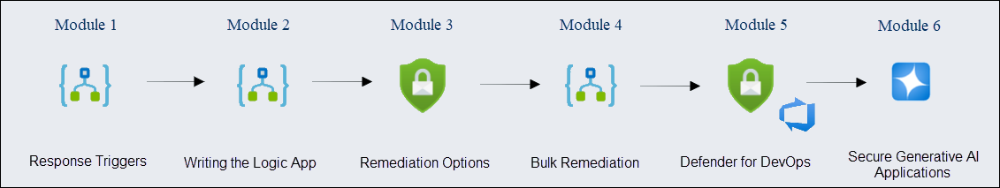
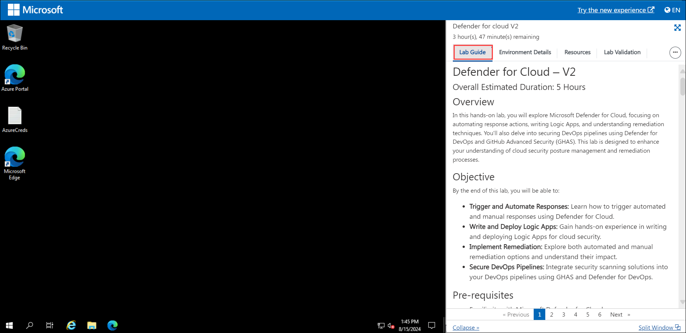
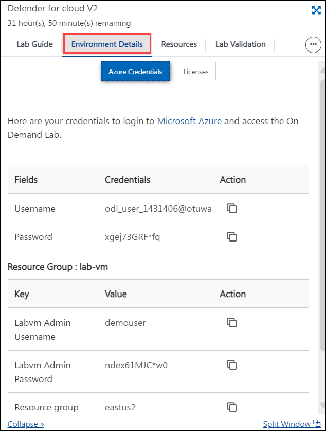
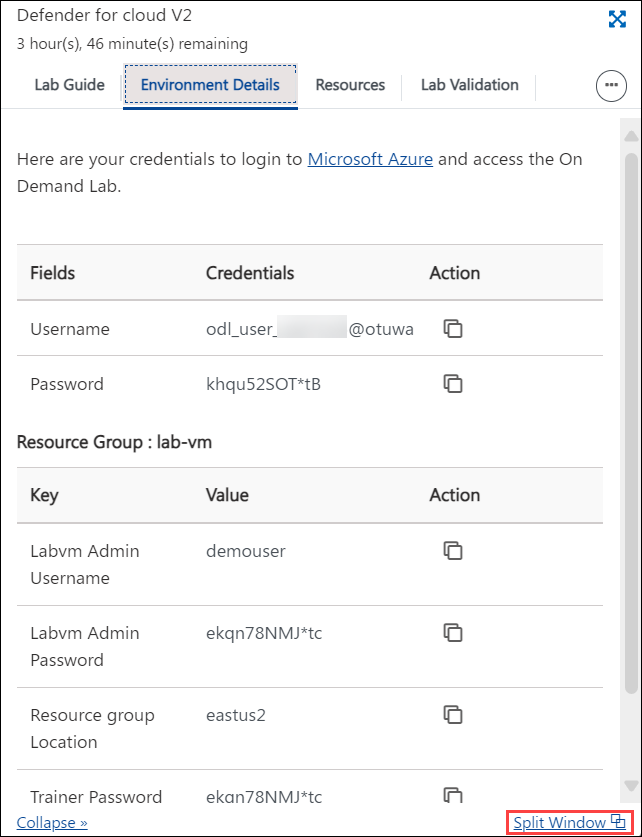
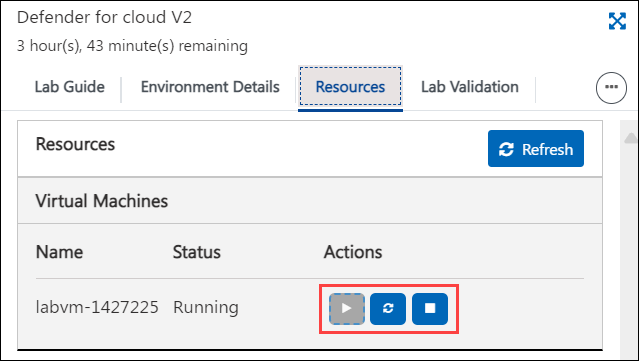
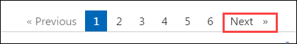

# Microsoft Defender for DevOps (Microsoft Defender for Cloud Workshop-V2)

### Overall Estimated Duration: 5 Hours

## Overview

In this hands-on lab, you will explore Microsoft Defender for Cloud, focusing on automating response actions, writing Logic Apps, and understanding remediation techniques. You'll also delve into securing DevOps pipelines using Defender for DevOps and GitHub Advanced Security (GHAS). This lab is designed to enhance your understanding of cloud security posture management and remediation processes.

## Objective

Understand how to utilize Azure DevOps and Defender for Cloud to enhance your cloud security posture. By the end of this lab, you will be able to:

- **Getting Started with Defender for Cloud:** Learn how to trigger automated and manual responses using Defender for Cloud. Gain insight into initiating and managing cloud security alerts and responses.
- **Writing and Deploying Logic Apps:** Develop hands-on skills in writing and deploying Logic Apps for cloud security automation. Understand how to integrate these apps into your cloud security strategy.
- **Implementing Remediation Strategies:** Explore automated and manual remediation options within Defender for Cloud and evaluate their effectiveness in addressing security issues.
- **Securing DevOps Pipelines:** Integrate security scanning solutions into your DevOps pipelines with GHAS and Defender for DevOps, ensuring continuous security throughout the development lifecycle.

## Pre-requisites

- Familiarity with Microsoft Defender for Cloud.
- Basic understanding of Logic Apps and Azure DevOps.
- Knowledge of cloud security principles.

## Architecture

The architecture for this lab focuses on integrating Microsoft Defender for Cloud with various security and automation tools to secure cloud resources and development pipelines. This architecture enables the automation of security responses, continuous monitoring of cloud environments, and the protection of CI/CD pipelines. Below is a detailed explanation of the architecture components and how they interact within the context of this lab.

## Architecture Diagram

  

## Explanation of Components

1. **Microsoft Defender for Cloud**: A comprehensive security management tool that provides advanced threat protection and unified security management across cloud and on-premises environments. It helps you prevent, detect, and respond to threats, enhancing the security posture of your resources.

2. **Logic Apps**: Azure Logic Apps are used to automate workflows and integrate systems and services across enterprises. In the context of Defender for Cloud, Logic Apps are employed to automate response actions, such as triggering remediation tasks when a security threat is detected.

3. **Triggers**: Triggers are the starting points for Logic Apps and other automated workflows. In Defender for Cloud, triggers are used to initiate workflows based on specific security alerts or events, enabling automated or manual responses.

5. **CI/CD Pipelines**: Continuous Integration and Continuous Deployment (CI/CD) pipelines are essential for modern software development, automating the process of building, testing, and deploying applications. Securing these pipelines with Defender for DevOps and GitHub Advanced Security helps to prevent vulnerabilities from being introduced into your software during the development process.

6. **GitHub Advanced Security (GHAS)**: GHAS provides advanced security features for GitHub repositories, including code scanning, secret detection, and dependency review. It integrates with Defender for DevOps to enhance the security of your development pipelines.

7. **Defender for DevOps**: A security solution that integrates with CI/CD pipelines to detect vulnerabilities and ensure that security best practices are followed throughout the software development lifecycle. It works alongside other tools like GHAS to provide comprehensive security coverage.

8. **Azure DevOps**: A set of development tools and services used for planning, developing, testing, and delivering software. In this lab, Azure DevOps is connected to Defender for Cloud to provide insights and recommendations for securing your pipelines.

9. **Defender Cloud Security Posture Management (DCSPM)**: DCSPM provides a holistic view of your cloud security posture, offering insights, recommendations, and automated actions to improve security. It plays a critical role in maintaining and enhancing the security of your cloud environments.

10. **Third-Party Security Scanning Tools**: These tools can be integrated with Defender for Cloud to provide additional security scanning capabilities beyond what is offered by Microsoft solutions. Integrating these tools allows for a more comprehensive security strategy that leverages the strengths of multiple providers.

## Getting Started with the Lab
 
## Accessing Your Lab Environment
 
Once you're ready to dive in, your virtual machine and lab guide will be right at your fingertips within your web browser.

   

## Virtual Machine & Lab Guide
 
Your virtual machine is your workhorse throughout the workshop. The lab guide is your roadmap to success.
 
## Exploring Your Lab Resources
 
To get a better understanding of your lab resources and credentials, navigate to the **Environment** tab.
 
   
 
## Utilizing the Split Window Feature
 
For convenience, you can open the lab guide in a separate window by selecting the **Split Window** button from the Top right corner.
 
 
 
## Managing Your Virtual Machine
 
Feel free to start, stop, or restart your virtual machine as needed from the **Resources** tab. Your experience is in your hands!
 

## Lab Duration Extension

1. To extend the duration of the lab, kindly click the **Hourglass** icon in the top right corner of the lab environment. 

    

    >**Note:** You will get the **Hourglass** icon when 10 minutes are remaining in the lab.

2. Click **OK** to extend your lab duration.
 
   

3. If you have not extended the duration prior to when the lab is about to end, a pop-up will appear, giving you the option to extend. Click **OK** to proceed.

## Let's Get Started with Azure Portal

1. On your virtual machine, click on the Azure Portal icon as shown below:

   .png)
   
1. You'll see the **Sign into Microsoft Azure** tab. Here, enter your credentials:
 
   - **Email/Username:** <inject key="AzureAdUserEmail"></inject>
 
       
 
1. Next, provide your password:
 
   - **Password:** <inject key="AzureAdUserPassword"></inject>
 
       

1. If **Action required** pop-up window appears, click on **Ask later**.

   
    
1. If prompted to stay signed in, you can click "No."
 
1. If a **Welcome to Microsoft Azure** pop-up window appears, simply click "Maybe Later" to skip the tour.

1. Click "Next" from the bottom right corner to embark on your Lab journey!

   

This hands-on-lab will help you to gain insights on how Azure OpenAI’s content filtering mechanisms contribute to responsible AI deployment, and how you can leverage these filters to ensure that your AI models adhere to appropriate content standards.

## Support Contact

The CloudLabs support team is available 24/7, 365 days a year, via email and live chat to ensure seamless assistance at any time. We offer dedicated support channels tailored specifically for both learners and instructors, ensuring that all your needs are promptly and efficiently addressed.

Learner Support Contacts:

- Email Support: labs-support@spektrasystems.com
- Live Chat Support: https://cloudlabs.ai/labs-support

Now, click on Next from the lower right corner to move on to the next page.

## Happy Learning!!
