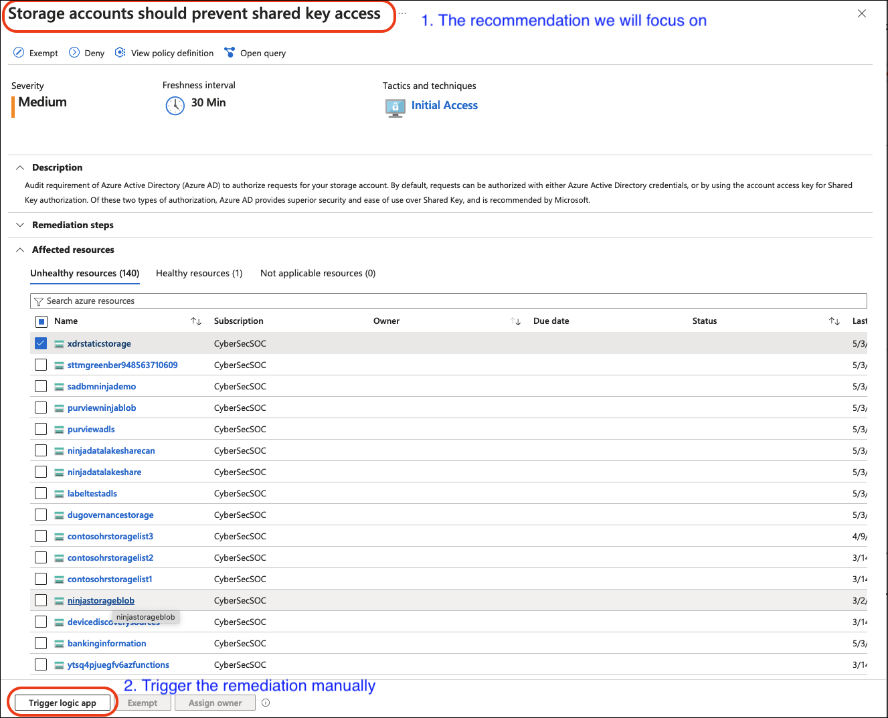

# Module 1 - Response Triggers

## Task 1: Triggering the Flow

You can respond to recommendations, alerts, and compliance findings using **Logic Apps** (we will build one in Module 2). The response logic app can be triggered either automatically or manually.

**Automated Response Setup:**

1. Set up *Workflow Automation* to trigger the logic app when Defender for Cloud detects the finding. Follow the procedure for setting up *Workflow Automation* [here](https://learn.microsoft.com/en-us/azure/defender-for-cloud/workflow-automation).
2. Azure Policies can be used to set up automation at [scale](https://learn.microsoft.com/en-us/azure/defender-for-cloud/workflow-automation#configure-workflow-automation-at-scale), though this workshop will not cover them.

## Task 2: Use Cases for Automated Trigger

Automated triggers are useful in the following scenarios:

- You have strict policy guidelines and want to maintain the risk at an acceptable level with **no exceptions**.
- You have already triaged the trigger, determined that there are no risk exceptions, and want to remediate as soon as the risk arises.
- The risk posed is far beyond your tolerance levels.

## Task 3: Use Cases for Manually Triggering the Response

Manual triggers are useful in the following scenarios:

- You are early in the deployment stages.
- You want to remediate only a handful of the unhealthy resources and will set exceptions for the remaining.
- The change management system is not directly linked with Logic Apps to trigger an automatic deployment.

Next, let's see how to [write the response logic app](./Module%202%20-%20Writing%20Logic%20App.md).