# Lab 4 : Bulk Remediation

## Overview:
In this lab, we'll explore an alternative remediation method using Azure Resource Graph (ARG). Instead of relying on Defender for Cloud triggers or governance flows, we'll directly query ARG and build our remediation process based on that data.

## Estimated Duration: 30 Minutes

## Lab Objectives :

In this lab, you will complete the following tasks:

- Task 1: Deploying the Logic App
- Task 2: Logic App Walkthrough

## Task 1: Deploying the Logic App

1. Open a new tab and paste the following link to create the Logic App in your target resource group:

     

1. On the **Custom deployment** blade, select the **defenderforcloud (1)** resource group from the drop-down menu and click **Review + create (2)**.

   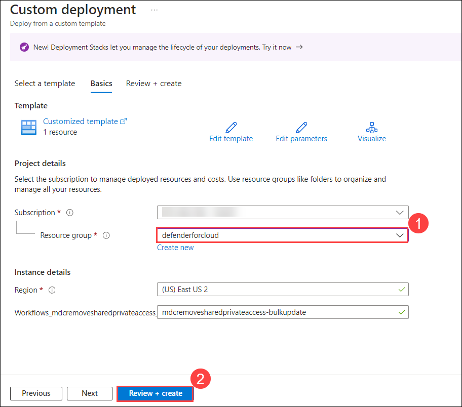

1. Click **Create** to start the deployment process.

1. Wait for the deployment to complete and click **Go to resource group**.

   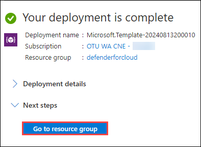

1. In the resource group, select the **mdcremovesharedprivateaccess-bulkupdate** Logic App from the list.

   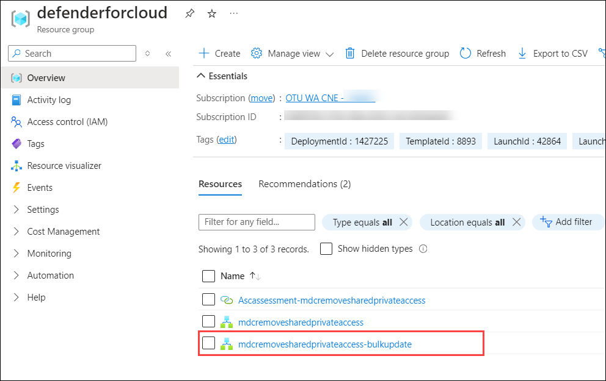

1. Navigate to **Settings** and select **Identity (1)** from the list.

1. Choose **System assigned (2)** and set the Status to **On (3)**.

1. Set the Permissions by clicking **Azure role assignments (4)**.

   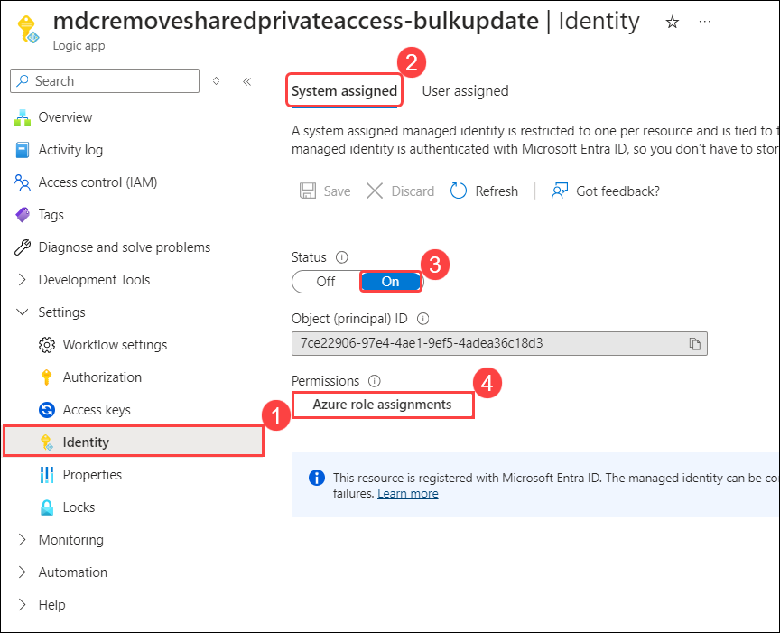

1. On the **Azure role assignments** page, select **+ Add role assignment (preview)**, set the **subscription** as the scope, and choose **Contributor** for the role. Then, click **Save**.   

   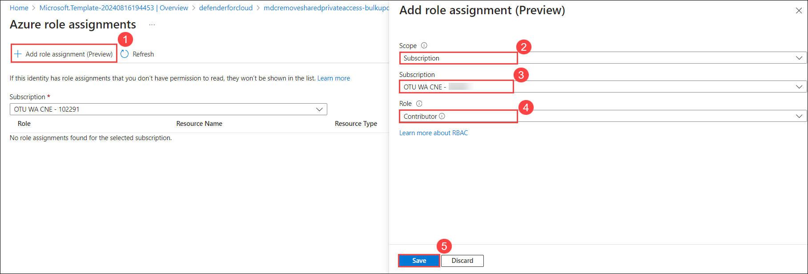

   >**Note:** By assigning "Contributor" to a specific subscription, the Logic App will only query and remediate resources within that subscription.

10. Once the **Role assignment** has succeeded navigate back to the **mdcremovesharedprivateaccess-bulkupdate** logic app overview page.

1. Click on **Edit** in the Azure Logic App interface allows which you to modify the existing workflow or configuration of the Logic App.

   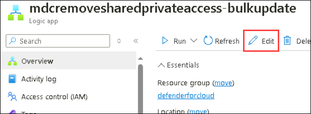

> **Congratulations** on completing the task! Now, it's time to validate it. Here are the steps:
- If you receive a success message, you can proceed to the next task.
- If not, carefully read the error message and retry the step, following the instructions in the lab guide.
- If you need any assistance, please contact us at cloudlabs-support@spektrasystems.com. We are available 24/7 to help you out.
 
<validation step="b68068ee-3edd-4d46-93e8-295ca9d07975" />

## Task 2: Logic App Walkthrough

Once deployed, the Logic App should appear as follows:

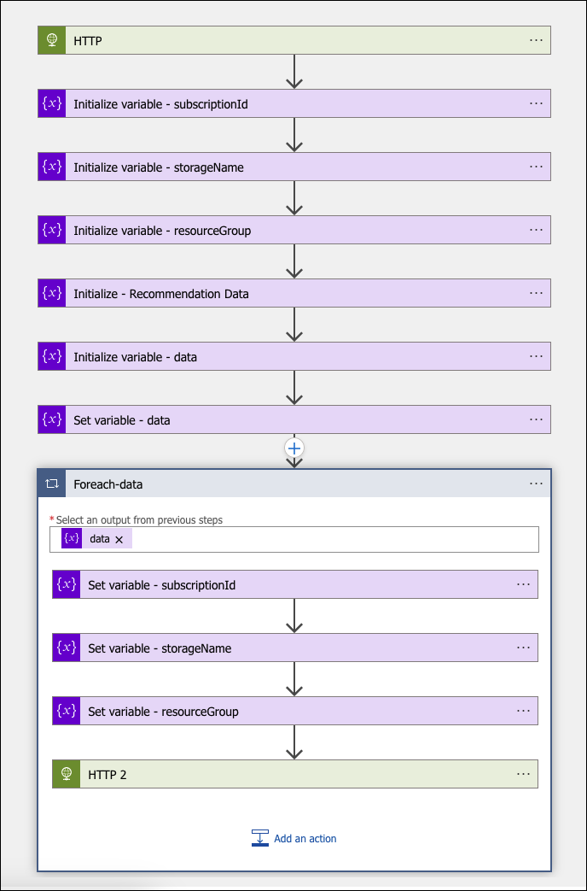

#### Step-by-Step Walkthrough:

1. **Querying Azure Resource Graph (ARG):**
   
- Navigate to Azure portal.

- Search and select **Microsoft Defender for Cloud** from the portal

   

- In the **Microsoft Defender for Cloud**, select **Recommendations** under General.

- Use the pre-defined query to retrieve data. Each recommendation has a corresponding query available on its page in Defender for Cloud.

   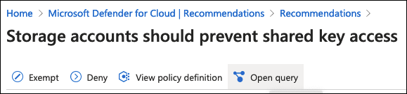

- Click **Open query** to access ARG. Copy the KQL query for use in the next step.

   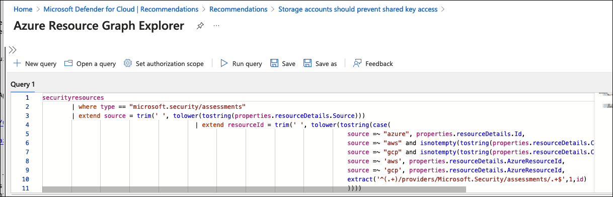

2. **Setting Up the ARG Query:**

- Navigate back to Logic app and select **mdcremovesharedprivateaccess-bulkupdate** Logic app.

- Use HTTP POST to execute the ARG query. Ensure authentication is done via Managed Identity.

   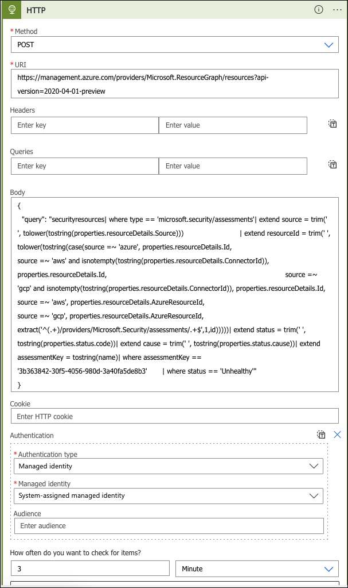

4. **Gathering Necessary Data:**
   
- Parse the query results to extract the required variables for remediation. This process is similar to the steps covered in [Module 2](./Module%202%20-%20Writing%20Logic%20App.md).

   

6. **Conducting the Remediation:**
   
- Loop through each unhealthy resource to perform remediation. Ensure you use Managed Identity for authentication here as well. The remediation process is similar to what was covered in [Module 2](./Module%202%20-%20Writing%20Logic%20App.md).

   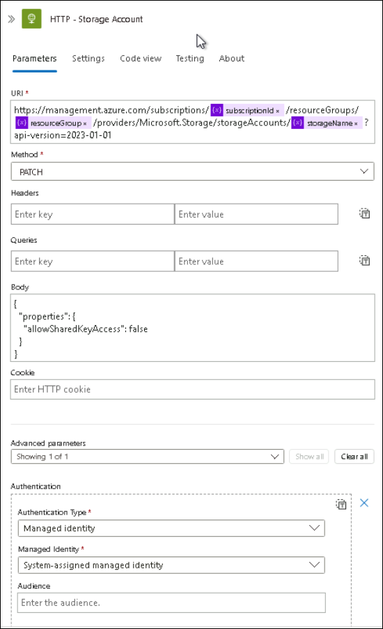

### Summary:

In this module, you have learned how to conduct bulk remediation based on Azure Resource Graph (ARG) data. This approach can also be applied to other data queries within ARG, enhancing your ability to manage and remediate resources efficiently.

## You have successfully completed the lab >> Click on Next
