# Module 5 – Defender for DevOps 

## Task 1: Understanding CI/CD pipelines in Azure DevOps 

Continuous Integration and Continuous Deployment (CI/CD) are critical practices in modern software development, enabling teams to deliver code changes more frequently and reliably. Azure DevOps provides a robust platform to implement CI/CD pipelines. Here’s a basic understanding and a simple pipeline example to get you started.

### CI/CD Pipelines in Azure DevOps

**Continuous Integration (CI):**
CI involves automatically building and testing your code every time a team member commits changes to version control. The key goals are to detect errors quickly and to improve software quality.

**Continuous Deployment (CD):**
CD extends CI by automatically deploying all code changes to a production environment after the build and test stages are successful. This ensures that the software is always in a releasable state.

### 1. Components of a CI/CD Pipeline

1. **Source Control:** Where the code resides (e.g., Git repository).
2. **Build:** The process of compiling the source code into executable artifacts.
3. **Test:** Automated tests run to validate the code.
4. **Release:** Deploying the artifacts to staging or production environments.

### 2. Set up an Azure DevOps organization.

1. On your lab VM open **Edge Browser** on desktop and navigate to [Azure DevOps](https://go.microsoft.com/fwlink/?LinkId=307137), and if prompted sign with the credentials.

   * Email/Username: <inject key="AzureAdUserEmail"></inject>

   * Password: <inject key="AzureAdUserPassword"></inject>

2. If prompted click **Ask later** on **Action Required** page.

3. On the next page accept defaults and click on continue.
   
   
   
4. On the **Almost Done...** page fill the captcha and click on continue. 

   
    
5. On the Azure DevOps page click on **Azure DevOps** located at top left corner and then click on **Organization Setting** at the left down corner

   .png)
    
6. In the **Organization Setting** window on the left menu click on **Billing (1)** .

   

1. Select **Setup Billing (2)** then click on **save (3)**.

       

7. On the **MS Hosted CI/CD (1)** section under **Paid parallel jobs** enter value **1** and at the end of the page click on **Save (2)**.

   

1. In the **Organization Settings** window, click on **Settings** in the left menu. On the settings page, enable the **Creation of Classic Release Pipeline** option.

   

1. On your lab computer, in a browser window open your Azure DevOps organization. Click on **New Project**. Give your project the name  **CICD (1)**, select visibility as **Private(2)**  and leave the other fields with defaults. Click on **Create project (3)**.

   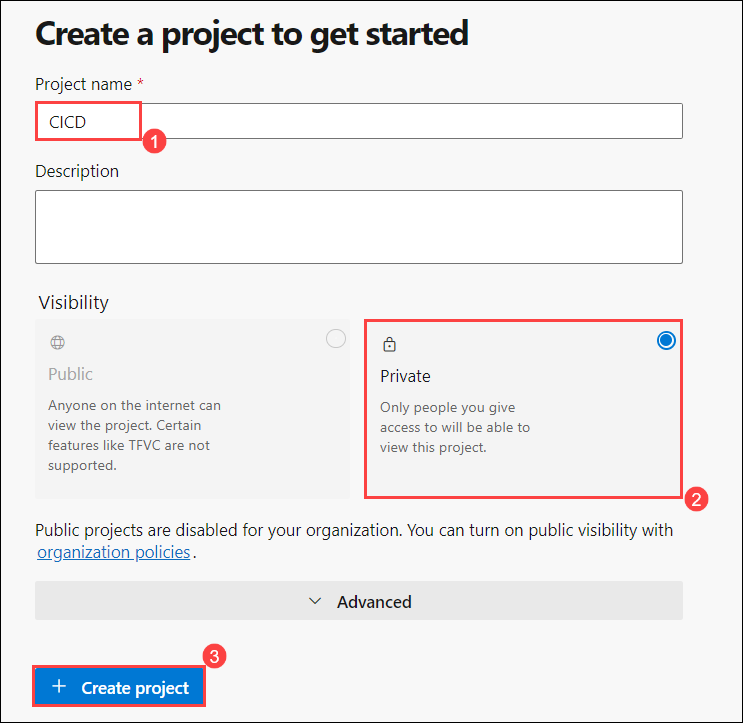
      
### 3. Create a Simple HTML File

1. Click on **Repos (1)>Files (2)**, Select **Initialize (3)**. 

   

1. First, let’s create a basic HTML file named `index.html`:

   

1. Add the following contnet to `index.html` file:

    ```html
    <!DOCTYPE html>
    <html>
    <head>
        <title>My Simple HTML Page</title>
    </head>
    <body>
        <h1>Hello, Azure DevOps!</h1>
        <p>This is a simple HTML page used to demonstrate CI/CD pipelines.</p>
    </body>
    </html>
    ```
1. Navigate back to the **Pipelines** pane in of the **Pipelines** hub.

1. In the **Create your first Pipeline** window, click **Create pipeline**.

   > **Note**: We will use the wizard to create a new YAML Pipeline definition based on our project.

1. On the **Where is your code?** pane, click **Azure Repos Git (YAML)** option.

   

1. On the **Select a repository** pane, click **CICD**.

   

1. On the **Configure your pipeline** pane, scroll down and select **Starter pipeline**.

   

1. Define your build pipeline in a file named `azure-pipelines.yml` with the following content:

    ```yaml
    trigger:
    - main

    pool:
    vmImage: 'ubuntu-latest'

    steps:
    - task: UsePythonVersion@0
    inputs:
        versionSpec: '3.x'
    displayName: 'Set up Python'

    - script: |
        echo "Building the HTML project..."
        mkdir output
        cp index.html output/
    displayName: 'Build Project'

    - task: PublishBuildArtifacts@1
    inputs:
        pathToPublish: 'output'
        artifactName: 'html-artifact'
    displayName: 'Publish Artifacts'
    ```
1. This YAML file does the following:
    - **Trigger**: Runs the pipeline when changes are pushed to the `main` branch.
    - **Pool**: Uses an Ubuntu VM image for the build.
    - **Steps**:
    - Set up Python (although not used in this case, you might need it for other tasks).
    - Create a directory called `output` and copy `index.html` to it.
    - Publish the contents of `output` as build artifacts.
   
8. Click **Save and Run** then click **Run** to start the Build Pipeline process.

   

9. Wait for the Build Pipeline to complete successfully. Ignore any warnings regarding the source code itself, as they are not relevant for this lab exercise.

    > **Note**: Each task from the YAML file is available for review, including any warnings and errors.

### 4. Create a Release Pipeline

1. Go to **Pipelines** > **Releases** > **New pipeline**.

   

1. From the **Select a template** window, **choose** **Azure App Service Deployment** (Deploy your application to Azure App Service. Choose from Web App on Windows, Linux, containers, Function Apps, or WebJobs) under the **Featured** list of templates.    

1. Click **Apply**.

   

1. Select the **CICD (1)**  in the Source (build pipeline) field. Click **Add (2)** to confirm the selection of the artifact.

   

1. On the All pipelines > New Release Pipeline pane, ensure that the **stage 2** is selected. In the **Azure subscription(2)** dropdown list, Confirm the App Type is set to **Web App on Windows(3)**. Next, in the App Service name dropdown list, select the name of the **asclab-app (4)** web app.

   

   >**Note**: After Selecting your Azure subscription and click Authorize. If prompted, authenticate by using the user account with the Owner role in the Azure subscription

1. Select the Task **Deploy Azure App Service**. In the **Package or Folder** field, update the default value of "$(System.DefaultWorkingDirectory)/**/*.zip" to **"$(System.DefaultWorkingDirectory)/_testing/html-artifact"**.

   

1.  On the **All pipelines > New Release Pipeline** pane, click **Save** and, in the **Save** dialog box, click **OK**.

    

1.  On the **All pipelines > New Release Pipeline** pane, click **Create release** .

    

1. Wait until the release pipline successfully completed.

   

1. Navigate to the Azure portal interface, navigate to the resource group **asclab**, in the list of resources, click the **asclab-app** web app.

1. On the web app blade, click **Browse**.

   

1. Verify that the web page loads successfully in a new web browser tab.

   

## Task 2: Identifying security issues in the pipeline 

To identify security issues in your pipeline with a straightforward approach, you can follow these basic steps to incorporate a security scan into your Azure DevOps pipeline. This focuses on integrating a basic security scan with minimal configuration:

### Security Scan with Snyk

**Snyk** is a popular tool for vulnerability scanning in open source dependencies. Here’s how to integrate Snyk into an Azure DevOps pipeline to identify security issues:

### 1. Set Up Snyk

1. **Create a Snyk Account**:
   - Sign up for a Snyk account if you don’t have one.

2. **Get Your Snyk Token**:
   - Go to your Snyk account settings to get your API token for authentication.

### 2. Integrate Snyk in Azure DevOps Pipeline

1. **Create or Edit Your Pipeline**:
   - In Azure DevOps, go to your project and create or edit a pipeline.

2. **Add a Snyk Security Scan Task**:
   - Insert the following YAML configuration into your pipeline file to run Snyk as part of your CI process:
Here’s an alternative way to achieve the same result using a slightly different approach. This version includes installing Node.js and Snyk as part of a single script, which can be more efficient:

        ```yaml
        trigger:
        - main

        pool:
        vmImage: 'ubuntu-latest'

        steps:
        - script: |
            echo "Setting up Node.js..."
            sudo apt-get update
            sudo apt-get install -y nodejs npm
            node --version
            npm --version
            
            echo "Installing Snyk..."
            npm install -g snyk

            echo "Installing dependencies..."
            npm install

            echo "Running Snyk Security Scan..."
            snyk test
        displayName: 'Setup, Install Dependencies, and Run Snyk Security Scan'
        ```

### Explanation:
1. **Setup Node.js**: The script manually installs Node.js and npm, which might be helpful if the `UseNode` task is not available or if you want to ensure the specific versions of Node.js and npm are installed.

2. **Install Snyk**: Installs Snyk globally.

3. **Install Dependencies**: Runs `npm install` to install project dependencies.

4. **Run Snyk Security Scan**: Executes the Snyk scan.

### 3. Review and Act on Results

1. **Check Pipeline Results**:
   - After running the pipeline, review the results of the Snyk scan in the pipeline logs. Snyk will report any vulnerabilities found.

2. **Resolve Identified Issues**:
   - Address any vulnerabilities reported by Snyk by updating dependencies or applying fixes.


## Task 3: Overview of GitHub Advanced Security (GHAS) [Read-Only] 

### Overview of GitHub Advanced Security (GHAS)

GitHub Advanced Security (GHAS) is a suite of security tools built into the GitHub platform designed to help developers secure their code and workflows. It includes features such as code scanning, secret scanning, and dependency review to identify and remediate security vulnerabilities and exposures.

### 1. Enable GitHub Advanced Security
To use GHAS, you need to have GitHub Advanced Security enabled for your repository. This typically requires a GitHub Enterprise subscription.

- Navigate to your repository on GitHub.
- Click on `Settings`.
- In the `Security` section, find `GitHub Advanced Security` and enable it.

### 2. Configure Code Scanning

**Code scanning** helps detect vulnerabilities and errors in your code by running static analysis tools.

- Go to the `Security` tab of your repository.
- Click on `Set up code scanning`.
- You can choose from different options like `CodeQL Analysis`, which is a powerful tool provided by GitHub. Select the `Set up this workflow` button for `CodeQL Analysis`.
- Review the configuration file (e.g., `.github/workflows/codeql-analysis.yml`). Modify it if needed and commit it to your repository.

### 3. Run Code Scanning

- Once configured, code scanning runs automatically on the specified events (like pushes and pull requests).
- You can also manually trigger a scan by going to the `Actions` tab, finding the `CodeQL` workflow, and clicking `Run workflow`.

### 4. Review Code Scanning Results

- Navigate to the `Security` tab, and under `Code scanning alerts`, you'll see a list of detected issues.
- Click on any alert to get detailed information about the vulnerability and recommended fixes.

### 5. Configure Secret Scanning

**Secret scanning** detects secrets (like API keys and tokens) that may have been accidentally committed to your repository.

- Go to the `Security` tab of your repository.
- Click on `Set up secret scanning`.
- GitHub automatically scans for patterns that match common secret types and alerts you if any are found.

### 6. Review Secret Scanning Results

- Navigate to the `Security` tab, and under `Secret scanning alerts`, you'll see a list of detected secrets.
- Click on any alert to view details and follow the steps to revoke or rotate the compromised secrets.

### 7. Set Up Dependency Review

**Dependency review** helps you understand and remediate vulnerable dependencies in your project.

- Ensure your project has a dependency manifest file (e.g., `package.json`, `pom.xml`).
- GitHub automatically generates dependency graphs and checks for known vulnerabilities in your dependencies.

### 8. Review Dependency Alerts

- Navigate to the `Security` tab, and under `Dependency review`, you'll see alerts for vulnerable dependencies.
- Click on any alert to see details about the vulnerability and recommended versions to update to.

### 9. Manage Security Policies

- In the `Security` tab, you can also manage security policies by setting up a `security.md` file to inform users about your project's security practices and how they can report vulnerabilities.

### 10. Continuous Monitoring and Alerts

- GitHub Advanced Security continuously monitors your repository and generates alerts for any new issues found.
- Make it a habit to regularly review the `Security` tab and address any new alerts promptly.

## Task 4: Overview of Defender for DevOps (including pricing) [Read-Only] 

#Defender for DevOps is a security solution by Microsoft designed to enhance the security of DevOps environments. It provides a range of tools and features to help secure the software development lifecycle (SDLC) and protect against threats that target DevOps processes. Here's an overview:

### Key Features:

1. Security for CI/CD Pipelines:

   - **Code Scanning:** Identifies vulnerabilities and security issues in your code before deployment.
   - **Dependency Scanning:** Detects known vulnerabilities in dependencies and libraries used in your projects.

2. Integration with Azure DevOps and GitHub:
   - **Azure DevOps:** Integrates with Azure Pipelines, Boards, Repos, and other Azure DevOps services to secure the DevOps lifecycle.
   - **GitHub:** Provides security insights and recommendations directly in your GitHub repositories.

3. Container Security:
   - **Image Scanning:** Scans container images for vulnerabilities before they are deployed.
   - **Runtime Protection:** Monitors running containers for security issues and potential threats.

4. Infrastructure as Code (IaC) Security:
   - **IaC Scanning:** Analyzes your IaC templates for security misconfigurations and vulnerabilities.

5. Policy Management:
   - **Compliance Policies:** Enforces security policies and compliance requirements across your DevOps processes.

6. Threat Detection and Response:
   - **Alerts and Notifications:** Provides real-time alerts on detected security threats and vulnerabilities.
   - **Incident Management:** Helps manage and respond to security incidents effectively.

### Pricing:

Defender for DevOps is included in Microsoft Defender for Cloud, and its pricing is generally based on the overall Defender for Cloud plan. Pricing may vary based on:

1. Number of Resources:
   - The cost may be influenced by the number of resources (e.g., pipelines, repositories, containers) being protected.

2. Features and Plans:
   - Microsoft Defender for Cloud offers different pricing tiers (e.g., Free, Standard, and Enhanced) that include various features and levels of protection. Defender for DevOps features are generally available in the Standard or Enhanced tiers.

3. Azure Consumption:
   - Costs are also related to the overall consumption of Azure resources and services.

For the most accurate and up-to-date pricing, it's best to consult the [Microsoft Defender for Cloud pricing page](https://azure.microsoft.com/en-us/pricing/details/defender-for-cloud/) or contact Microsoft sales support directly.

## Task 5: Securing your pipeline with GHAS 

To secure your pipeline with GitHub Advanced Security (GHAS) and Microsoft Defender for DevOps, you can integrate these tools to enhance your pipeline's security posture. Here’s a example of how to use GHAS and Defender for DevOps for security:

### 1. GitHub Advanced Security (GHAS)

**GitHub Advanced Security** provides several features to secure your code, including code scanning, secret scanning, and dependency review.

1. Copy the link and open it in a browser window to log in to GitHub.

   ```
   https://github.com/login
   ```

2. In the sign-in to GitHub page in the Edge browser, enter the **GitHub UserEmail** and **GitHub Password** and click on **Sign in**.


   >**Note:** Use your personal GitHub account to perform this task. If you don't have a GitHub account, create a new one by following the instructions in this [Microsoft document](https://docs.microsoft.com/en-us/github/get-started/sign-up-for-github).

1. Navigate to `https://github.com/ghas-bootcamp/ghas-bootcamp/fork` and click on **Create fork**

1. In the GitHub repository navigate to **Settings** from the top navigation pane and click on **Code Security and Analysis** under Security.

1. Scroll down and you will find the **Code Scanning** option.Click on **Set up code scanning**.

   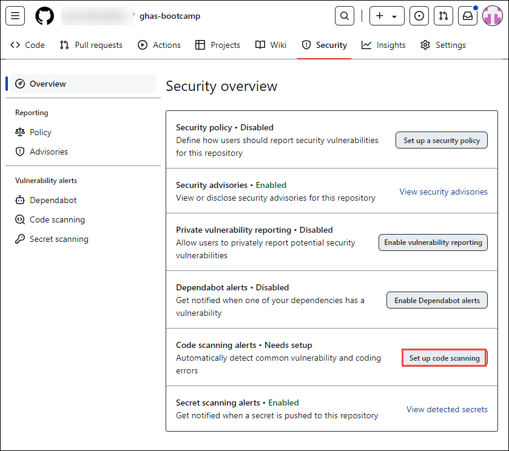

1. Now, Click on the **Setup** button and click on **Advanced**.

   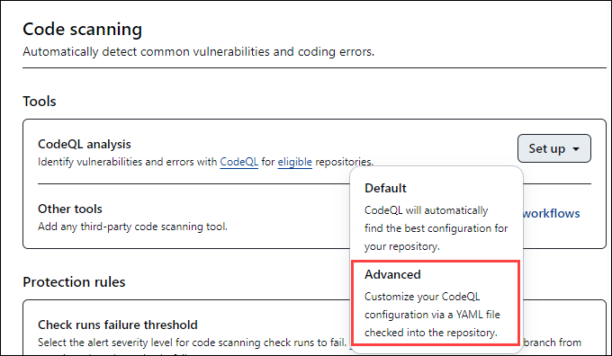

1. Now you are redirect you to the codeql.yml file in github/ workflows, review the yml file and then click on **commit changes**. 

   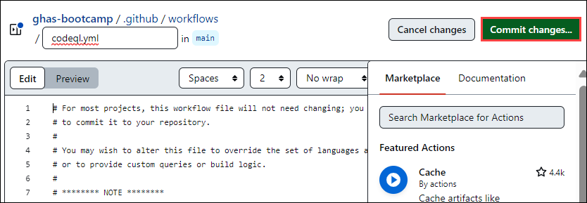

1. Again, click on **Commit changes**.

   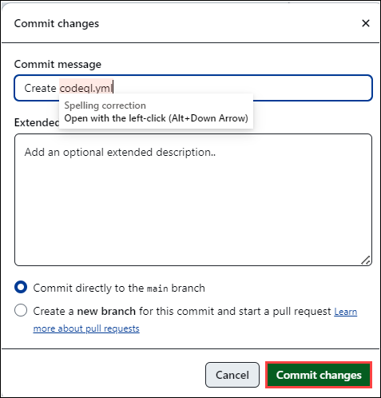

1. Navigate, to **actions** tab and wait until shows a successful run of a GitHub Actions workflow.

   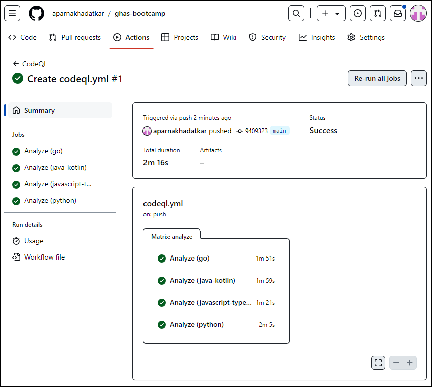

1. In the repository navigate to **Settings** from the top navigation pane, Scroll down to **Secret Scanning** and ensure that **Secret Scanning** is enabled.

   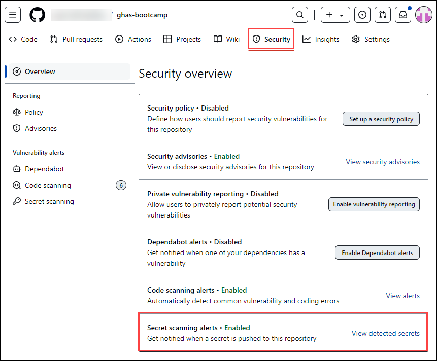

1. Go to **Security** and scroll down to **Dependabot alerts** and enable **Dependabot** for automated dependency updates and reviews.

   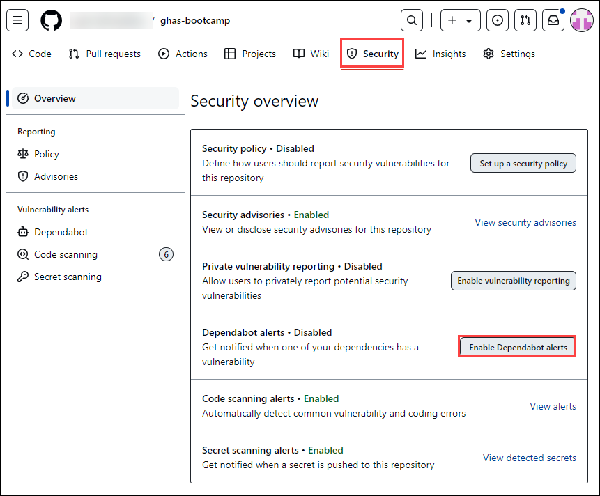

1. **Code Scanning** is enabled with CodeQL for identifying code vulnerabilities, while **Secret Scanning** and **Dependency Review** are managed through GitHub’s settings.

1. Integrating GHAS enhances your pipeline’s protection against security threats and vulnerabilities.

## Exercise 6: Connecting and Securing your Azure DevOps environment to MDC 

1. Search and select **Microsoft Defender for Cloud** from the portal

   

1. Select **skip** on **Getting started** tab.

   

1. Select **Environment settings** under Management > **+Add environment** > **Azure DevOps**

   

1. On the **Azure DevOps Connection** page, under **Account details**, provide the below settings.

   | Setting  | Value |
   -----------|---------
   | Connector name | AzureDevopsconnector |
   | Subscription | Choose the default subscription |
   | Resource group | Lab-VM |
   | Location | Select any supporting region |

   

1. Select **Next: Configure access**

1. Select **Authorize**. Ensure you're authorizing the correct Azure Tenant using the drop-down menu in Azure DevOps and by verifying you're in the correct Azure Tenant in Defender for Cloud.

1. In the popup dialog, read the list of permission requests, and then select **Accept**.

   

1. Leave all other settings as default.

1. Select **Next: Review and generate**.

1. Review the information, and then select **Create**.

1. Wait for some time to view the connector on the **Environment settings** page.

1. Navigate to **DevOps Security** under **Cloud Security**.

   

1. The **DevOps security findings** and **DevOps security results** are listed on the page, which helps to review the DevOps security posture.

   

   >**Note:** It might take upto 8hrs to reflect the real-time status.

1. Navigate to **DevOps workbook** and change the toggle to **Yes**, which provides an overview of the tabs provided below

   

   

1. Navigate to the **Code** tab and scroll down, click on the **Severity** section to open the individual findings, and click on **Information** which in turn provides detailed findings and the issue location.

   

1. Similarly, navigate to the **OSS Vulnerabilities** tab and identify the issues, then take note of the recommendations provided to resolve the issues.

   

## Task 7: Integrating non-MS security scan solutions with MDC 

Integrating non-Microsoft security scan solutions with Microsoft Defender for Cloud (MDC) can provide a more comprehensive security posture. Using Nmap as an example:

### 1. Setting Up Nmap on a Windows VM

1. Visit the official website using the URL https://nmap.org/download.html then click on **Windows**.

   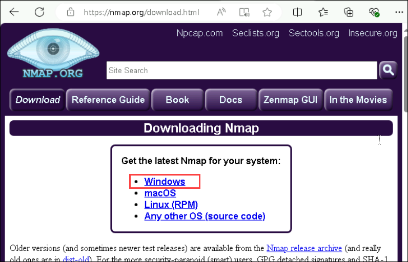

1. Click on **nmap-7.92-setup.exe** Downloading of this executable file will start soon. It is a 21.8 MB file so it will take some minutes. 

   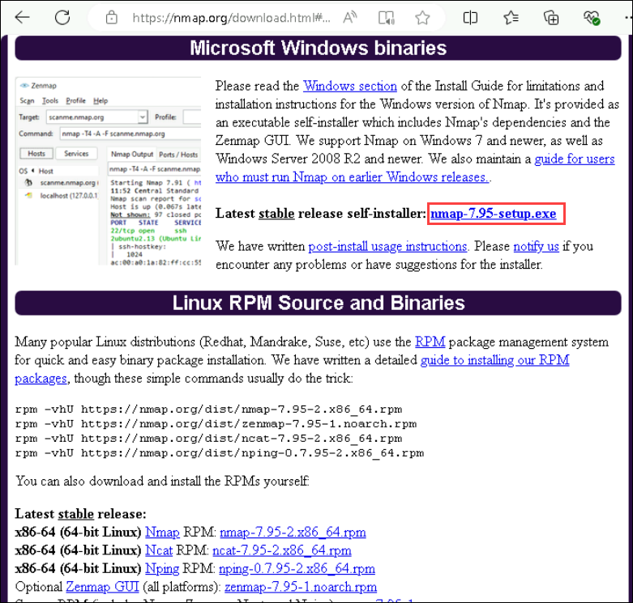

1. Now check for the executable file in downloads in your system and run it.

1. It will prompt confirmation to make changes to your system. Click on Yes.

1. The next screen will be of License Agreement, click on **I Agree**.
  
   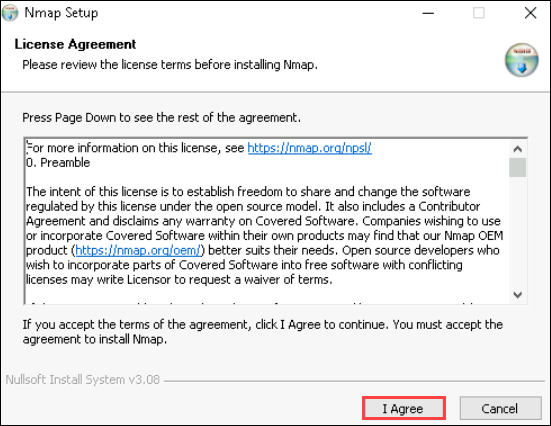

1. Next screen is of choosing components, all components are already marked so don’t change anything just click on the **Next** button.

   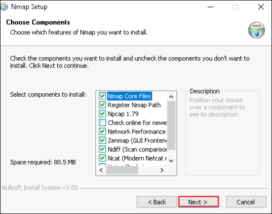

1. In this step, we choose the installation location of Nmap. By default, it uses the C drive but you can change it into another drive that will have sufficient memory space for installation. It requires 80.5 MB of memory space.

   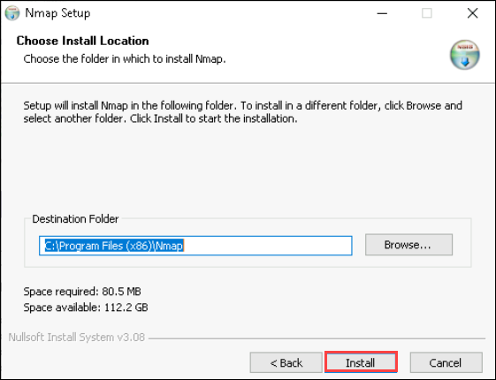

1. After this installation process it will take a few minutes to complete the installation.

   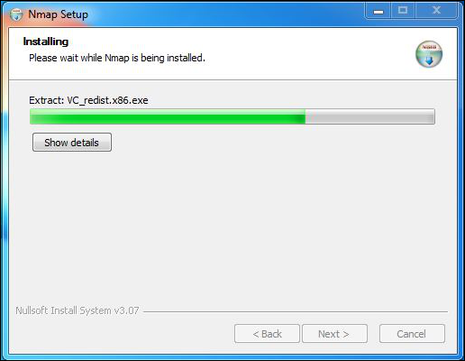

1. Npcap installation will also occur with it, the screen of License Agreement will appear, click on **I Agree**.

   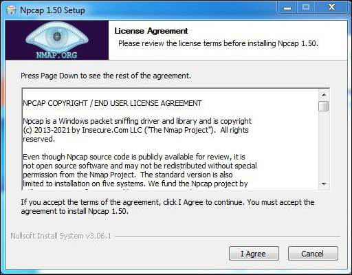

1. Next screen is of installation options don’t change anything and click on the **Install** button.

   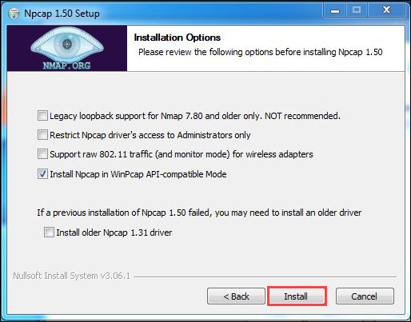

1. After this installation process it will take a few minutes to complete the installation.

   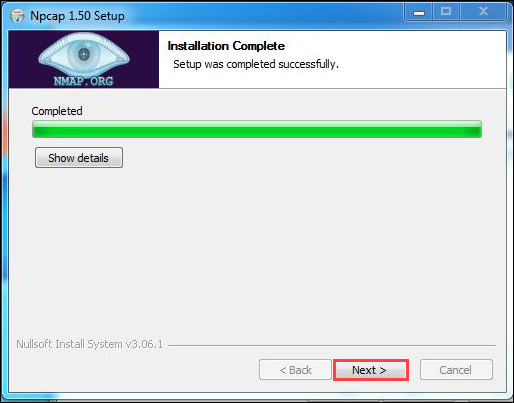

1. Click on the Finish button to finish the installation of Npcap.

   

1. After completion of installation click on the Next button.

   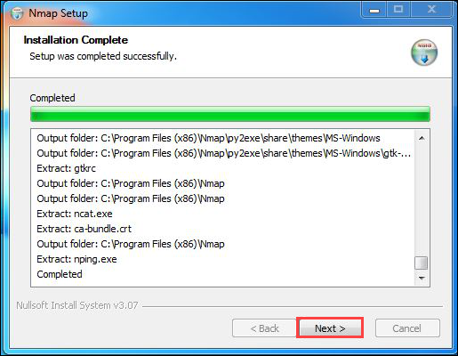

1. Click on the Finish button to finish the installation of Npcap.

   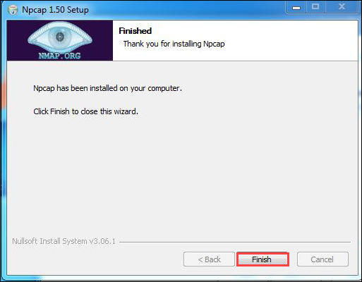

1. Screen for creating shortcut will appear, click on **Next** button.

   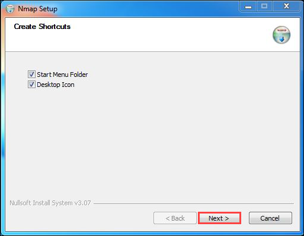

1. Click on the **Finish** button to finish the installation of Nmap.

   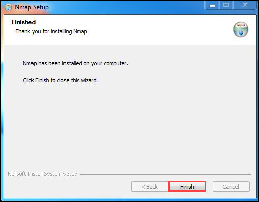

1. You have successfully installed Nmap on your windows system.

**Run a Basic Nmap Scan:**

1. Click the **Start** menu, type `cmd` into the search bar, and then select **Command Prompt** from the search results.
    
   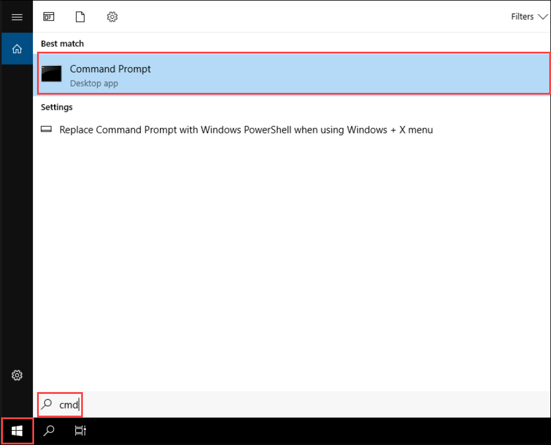

1. Execute a basic Nmap scan command:

    ```
    cd "\Program Files (x86)\Nmap"
    ```
    ```
    nmap -sS -p 1-65535 <target-ip>
    ```
   >**Note** Replace `<target-ip>` with the IP address of the **labVM** you want to scan. You can find the IP address of the LabVM in the **Overview** section of the LabVM in the Azure portal.
    
   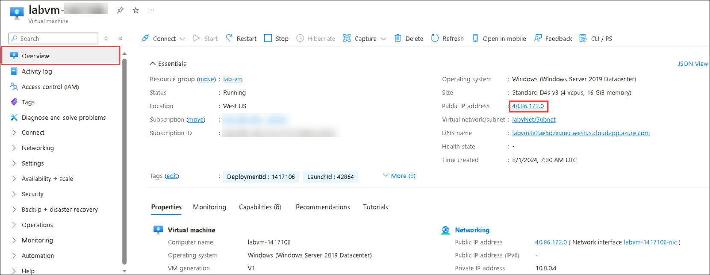

3. Export the scan results to a file for manual review:

     ```
     nmap -sS -p 1-65535 <target-ip> -oX nmap_scan_results.txt
     ```
   >**Note:** This saves the results in txt format in the `C:\Program Files (x86)\Nmap` folder.

   >**Note** Replace `<target-ip>` with the IP address of the **labVM** you want to scan. You can find the IP address of the LabVM in the **Overview** section of the LabVM in the Azure portal.

### 2. Correlating Nmap Results with Defender for Cloud

1. Open the `nmap_scan_results.txt` file in a text editor to see the results of an Nmap scan on the IP address 40.86.172.0. The scan covers ports 1-65535, identifying open ports on the target. Use this information to find and secure potentially risky open ports. Nmap helps gather data on open ports to guide security actions in Azure or other platforms.

   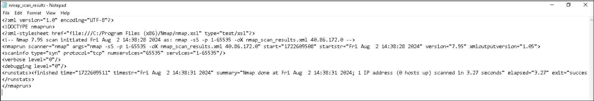

1. Navigate to **Microsoft Defender for Cloud** in the Azure portal and review the alerts and recommendations provided by Defender for Cloud.

1. Search for and select the **Management ports should be closed on your virtual machine** recommendation. This Azure security recommendation indicates that management ports on a virtual machine (e.g., labvm-1417106) should be closed to reduce the risk of Internet-based attacks. Open management ports (such as RDP or SSH) pose a high risk by exposing the VM to potential brute force attacks. The recommendation offers actionable remediation steps, including:

   - Using a "Quick fix" to automatically close the ports.
   - Manually editing inbound rules.
   - Using Just-in-Time VM access.

1. Azure's built-in tools and recommendations can help secure virtual machines effectively.

   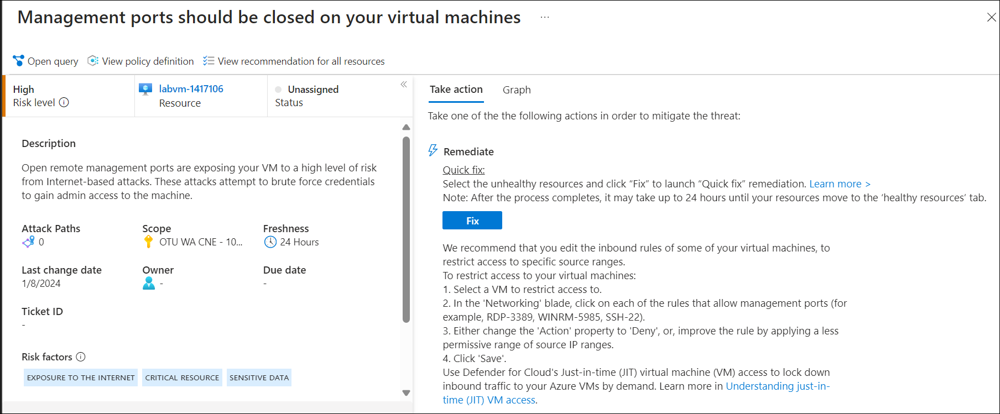

1. Microsoft Defender for Cloud recommendations offer high-level security alerts and suggested actions from Azure. In contrast, Nmap scan results provide detailed technical data to identify and verify open ports on a virtual machine. Both are essential for robust network security, ensuring that potentially vulnerable open ports are properly managed and secured.

## Task 8: Role of Defender Cloud Security Posture Management (DCSPM) 

###  Understanding Microsoft Data Security Posture Management

**Data Security Posture Management (DSPM)** allows security teams to get ahead of their data risks and prioritize security issues that could result in a data breach. With DSPM you can:
     
   - Automatically discover sensitive data resources across multiple clouds.

   - Evaluate data sensitivity, data exposure, and how data flows across the organization.

   - Proactively and continuously uncover risks that might lead to data breaches.

   - Detect suspicious activities that might indicate ongoing threats to sensitive data resources.
     
1. Defender for Cloud leverages **DSPM** data to prioritize critical data risks by distinguishing them from other risks by:

    - Highlighting attack paths of internet-exposed VMs that have access to sensitive data stores.
    - Allowing you to leverage Cloud Security Explorer to identify misconfigured data resources that are publicly accessible and contain sensitive data, across multi-cloud environments. 

    

2. Data sensitivity context is also used in Security Alerts and you can quickly filter based on the type of Sensitivity Information. Navigate to **Security alerts** click on **Add filters**, and set it to **Sensitivity info types**.

     

### Enabling Defender CSPM plan

In this exercise, you will learn how to enable Defender for CSPM and leverage Defender for CSPM Capabilities

   >**Note:** To gain access to the capabilities provided by Defender CSPM, you'll need to <a href="https://learn.microsoft.com/en-us/azure/defender-for-cloud/enable-enhanced-security">enable the Defender Cloud Security Posture Management (CSPM) plan </a> on your subscription

1. **Defender Cloud Security Posture Management**, will reduce the critical risks by:

    - **Monitor your multi-cloud security posture**: It gets continuous security assessments of your resources running across Microsoft Azure, AWS, Google Cloud Platform, and on-premises.
     
    - **Prioritize risks with contextual insights**: Identifies your most critical risks with insights from the security operations center (SOC), DevOps, APIs, Microsoft Defender External Attack Surface Management, Microsoft Entra Permissions Management, and Microsoft Purview, all in a single view.
     
    - **Get agent and agentless vulnerability scanning**: It gets continuous, real-time monitoring with agentless vulnerability scanning and gains deeper protection from built-in agents.
     
    - **Maintain compliance with multi-cloud benchmarks**: It follows best practices for multi-cloud security compliance with controls mapped to major regulatory industry benchmarks, such as the Center for Internet Security, the Payment Card Industry, and the National Institute for Standards and Technology, in a central dashboard. 

1. In **Azure Portal**, search for **Microsoft Defender for Cloud (1)** and then click on it from the search results **(2)**. 

    

2. From **Defender for Cloud** menu, click on **Environment Settings (1)** page and select your subscription **(2)**.

    

3. In the **Defender plans** page, select **Defender CSPM** turn the status to **On (1)** and select **Settings & monitoring (2)**.

    

4. Turn **On (1)** the **Agentless scanning for machines (preview)** and click **Continue (2)**.

    

5. Click on **Save** to save the changes. 

   >**Note:** Agentless scanning for VMs provides vulnerability assessment and software inventory in 24 hours. Leave the setup and comeback after 24 hours.

    
