# **Module 5 – Defender for DevOps**

## **Task 1: Understanding CI/CD pipelines in Azure DevOps**

Continuous Integration and Continuous Deployment (CI/CD) are critical practices in modern software development, enabling teams to deliver code changes more frequently and reliably. Azure DevOps provides a robust platform to implement CI/CD pipelines. Here’s a basic understanding and a simple pipeline example to get you started.

### CI/CD Pipelines in Azure DevOps

**Continuous Integration (CI):**
CI involves automatically building and testing your code every time a team member commits changes to version control. The key goals are to detect errors quickly and to improve software quality.

**Continuous Deployment (CD):**
CD extends CI by automatically deploying all code changes to a production environment after the build and test stages are successful. This ensures that the software is always in a releasable state.

### 1. Components of a CI/CD Pipeline

1. **Source Control:** Where the code resides (e.g., Git repository).
2. **Build:** The process of compiling the source code into executable artifacts.
3. **Test:** Automated tests run to validate the code.
4. **Release:** Deploying the artifacts to staging or production environments.

### 2. Set up an Azure DevOps organization.

1. On your lab VM open **Edge Browser** on desktop and navigate to [Azure DevOps](https://go.microsoft.com/fwlink/?LinkId=307137), and if prompted sign with the credentials.

   * Email/Username: <inject key="AzureAdUserEmail"></inject>

   * Password: <inject key="AzureAdUserPassword"></inject>

2. If prompted click **Ask later** on **Action Required** page.

3. On the next page accept defaults and click on continue.
   
   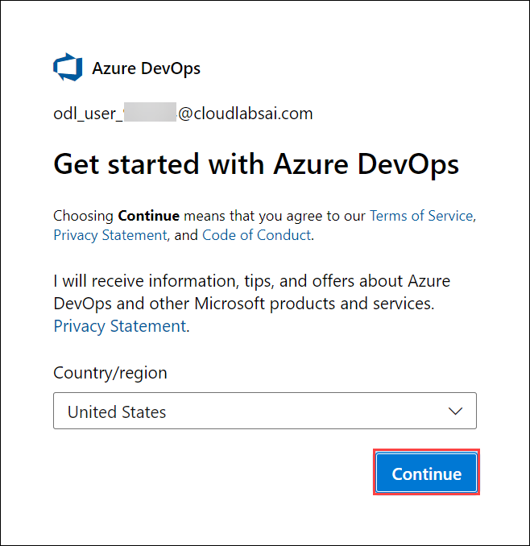
   
4. On the **Almost Done...** page fill the captcha and click on continue. 

   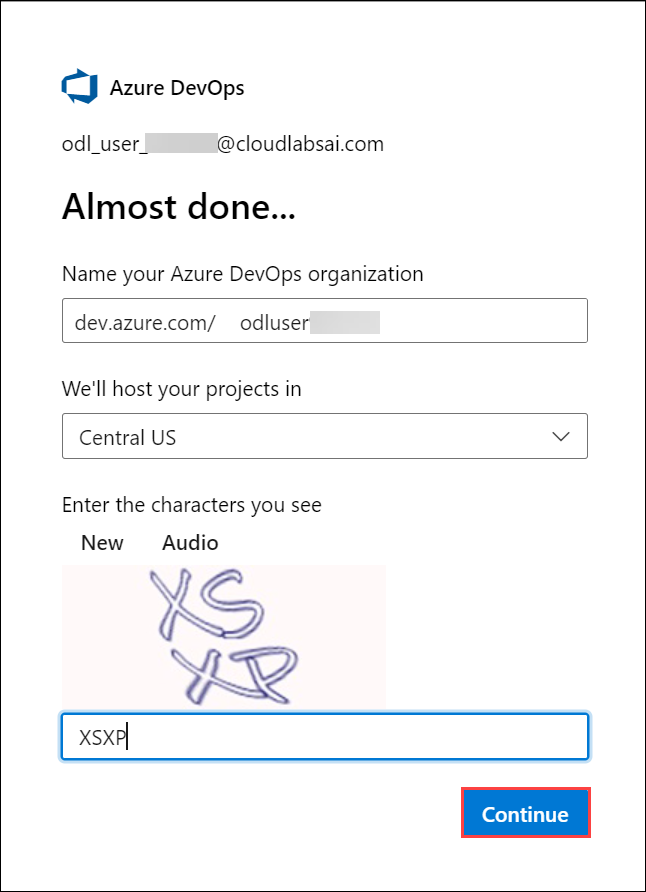
    
5. On the Azure DevOps page click on **Azure DevOps** located at top left corner and then click on **Organization Setting** at the left down corner

   .png)
    
6. In the **Organization Setting** window on the left menu click on **Billing (1)** .

   

1. Select **Setup Billing (2)** then click on **save (3)**.

   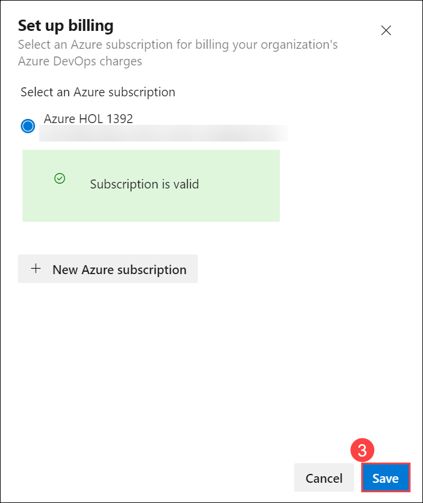    

7. On the **MS Hosted CI/CD (1)** section under **Paid parallel jobs** enter value **1** and at the end of the page click on **Save (2)**.

   

1. On the **Organization Settings** page, go to the Security section and click **Policies** (1). Enable the toggles for both **Third-party application access via OAuth** (2) and **Allow public projects** (3), then click **Save** (4) when prompted to Change policy setting.

    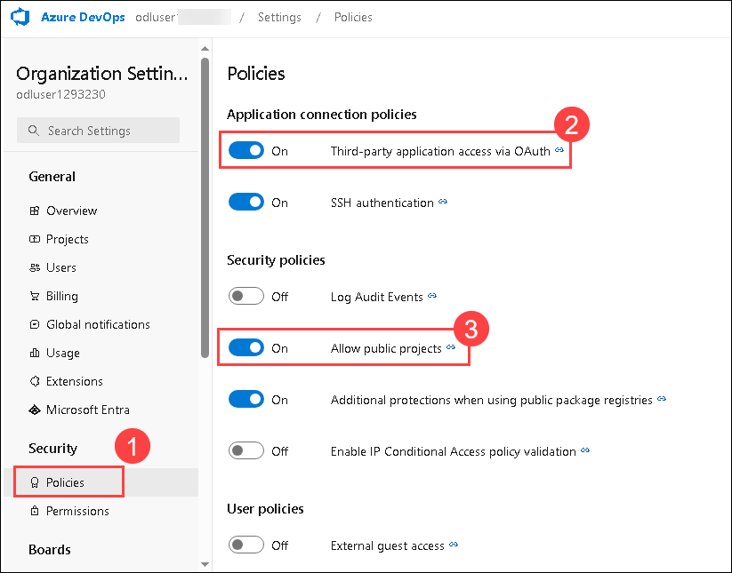

1. In the **Organization Settings** window, click on **Settings** in the left menu. On the settings page, toggles for **Creation of Classic Release Pipeline** option.

   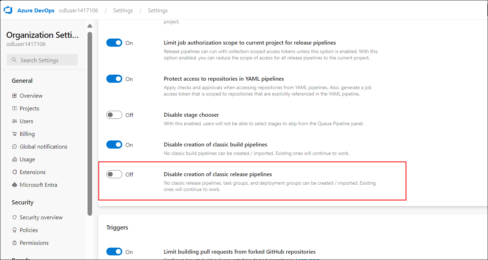

1. On your lab computer, in a browser window open your Azure DevOps organization. Click on **New Project**. Give your project the name  **Defender_for_cloud (1)**, select visibility as **Private(2)**  and leave the other fields with defaults. Click on **Create project (3)**.

   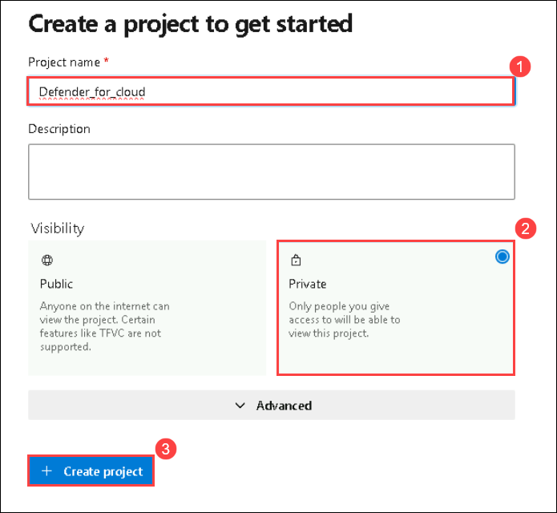

1. Click **Project settings (1)** in the lower-left corner. In the left menu under Repos, click **Repositories (2)**, then select the **Defender_for_cloud (3)** repository.

   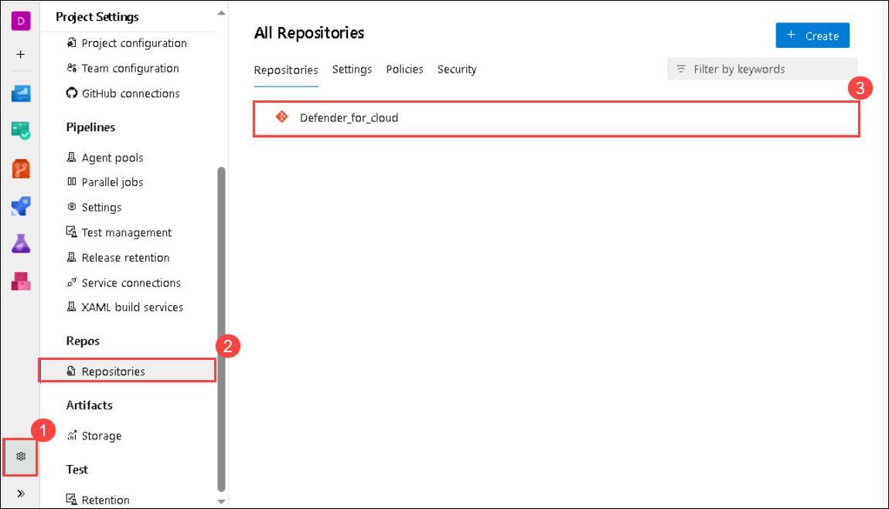

1. Click on **Settings (1)**, then click on **Advanced Security (2)**, to turn it **On** and click **Enable all**.

   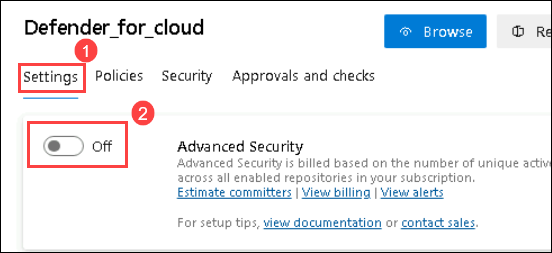

1. Click **Begin Billing**.

   

### 3. Create a Simple HTML File

1. Click on **Repos (1)>Files (2)**, Select **Initialize (3)**. 

   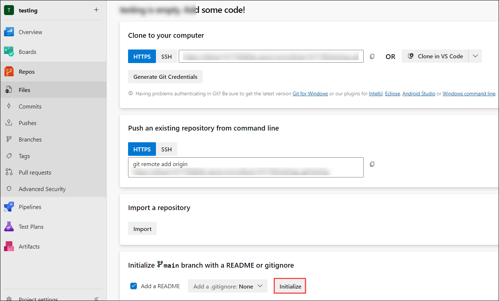

1. Click on the three-dot menu (`...`) in the top-right corner of the repository's file explorer section. This menu provides additional actions you can take within the repository.

1. After clicking the three-dot menu, a dropdown list appears. From this list, hover over the **New** option. This will allow you to create new items in the repository.

1. Under the **New** submenu, you have the option to create a "File" or a "Folder." In this case, you would click on **File** to start creating a new file within the repository.

   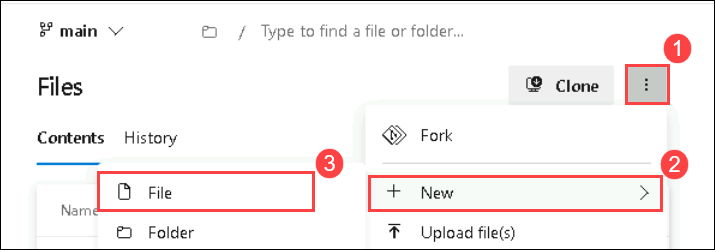

1. A prompt will appear asking you to name your new file.

2. Enter a name for your HTML file, such as `index.html`.

   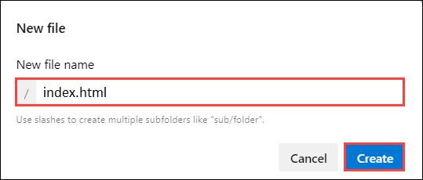

1. Add the following contnet to `index.html` file:

    ```html
    <!DOCTYPE html>
    <html>
    <head>
        <title>My Simple HTML Page</title>
    </head>
    <body>
        <h1>Hello, Azure DevOps!</h1>
        <p>This is a simple HTML page used to demonstrate CI/CD pipelines.</p>
    </body>
    </html>
    ```

1. After writing your code, you can commit the changes by filling in the commit message and selecting whether to commit directly to the main branch or a different one.

1. Click **Commit** to save the file to your repository.

1. Navigate back to the **Pipelines** pane in of the **Pipelines** hub.

1. In the **Create your first Pipeline** window, click **Create pipeline**.

   > **Note**: We will use the wizard to create a new YAML Pipeline definition based on our project.

1. On the **Where is your code?** pane, click **Azure Repos Git (YAML)** option.

   

1. On the **Select a repository** pane, click **Defender_for_cloud**.

   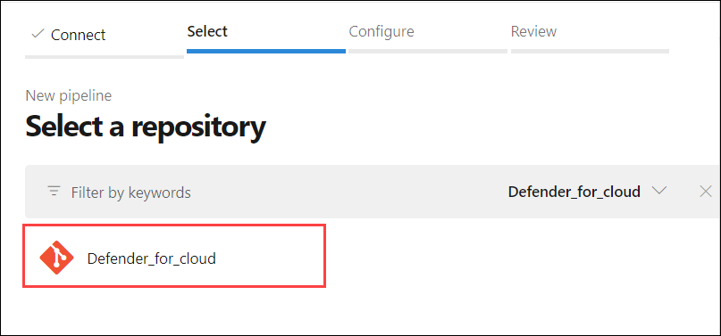

1. On the **Configure your pipeline** pane, scroll down and select **Starter pipeline**.

   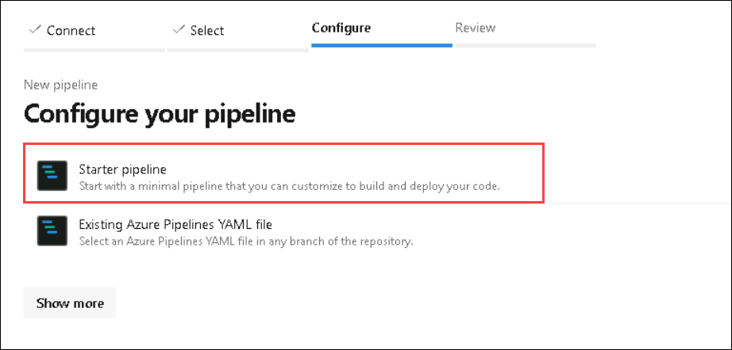

1. Define your build pipeline in a file named `azure-pipelines.yml` with the following content:

   ```yaml
   trigger:
   - main

   pool:
     vmImage: 'ubuntu-latest'

   steps:
   - task: UsePythonVersion@0
     inputs:
       versionSpec: '3.x'
     displayName: 'Set up Python'

   - script: |
      echo "Building the HTML project..."
      mkdir output
      cp index.html output/
     displayName: 'Build Project'

   - task: PublishBuildArtifacts@1
     inputs:
       pathToPublish: 'output'
       artifactName: 'html-artifact'
     displayName: 'Publish Artifacts'
   ```
1. This YAML file does the following:
    - **Trigger**: Runs the pipeline when changes are pushed to the `main` branch.
    - **Pool**: Uses an Ubuntu VM image for the build.
    - **Steps**:
    - Set up Python (although not used in this case, you might need it for other tasks).
    - Create a directory called `output` and copy `index.html` to it.
    - Publish the contents of `output` as build artifacts.
   
8. Click **Save and Run** then click **Run** to start the Build Pipeline process.

   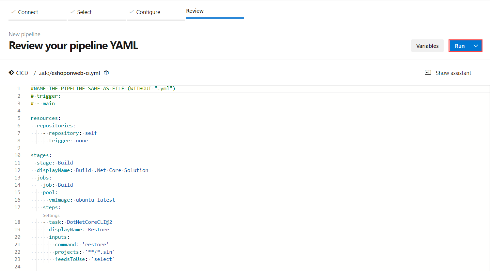

9. Wait for the Build Pipeline to complete successfully.

    > **Note**: Each task from the YAML file is available for review, including any warnings and errors.

### 4. Create a Release Pipeline

1. Go to **Pipelines** > **Releases** > **New pipeline**.

   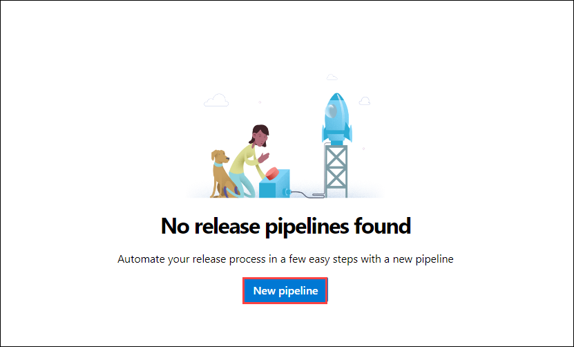

1. From the **Select a template** window, **choose** **Azure App Service Deployment** (Deploy your application to Azure App Service. Choose from Web App on Windows, Linux, containers, Function Apps, or WebJobs) under the **Featured** list of templates.    

1. Click **Apply**.

   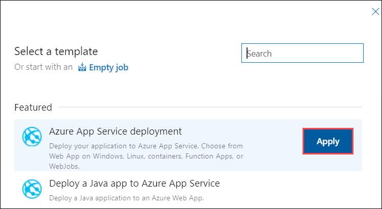

1. Select the **Defender_for_cloud (1)**  in the Source (build pipeline) field. Click **Add (2)** to confirm the selection of the artifact.

   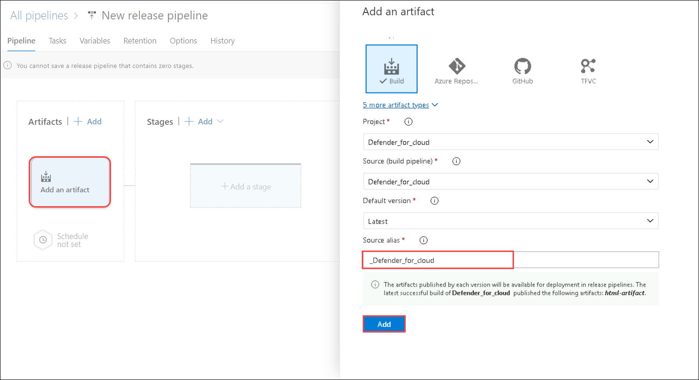

1. On the All pipelines > New Release Pipeline pane, ensure that the **stage 2** is selected. In the **Azure subscription(2)** dropdown list, Confirm the App Type is set to **Web App on Windows(3)**. Next, in the App Service name dropdown list, select the name of the **asclab-app (4)** web app.

   

   >**Note**: After Selecting your Azure subscription and click Authorize. If prompted, authenticate by using the user account with the Owner role in the Azure subscription

1. Select the Task **Deploy Azure App Service**. In the **Package or Folder** field, update the default value of "$(System.DefaultWorkingDirectory)/**/*.zip" to **"$(System.DefaultWorkingDirectory)/_Defender_for_cloud/html-artifact"**.

   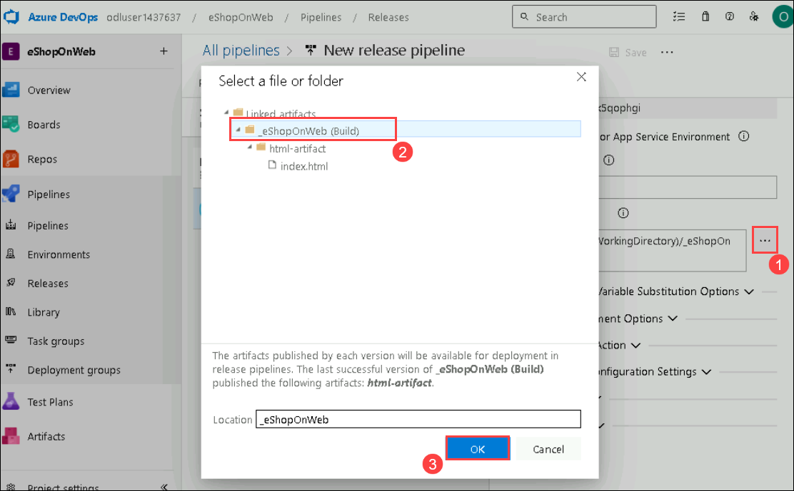

1. On the **All pipelines > New Release Pipeline** pane, click **Save** and, in the **Save** dialog box, click **OK**.

   

1. On the **All pipelines > New Release Pipeline** pane, click **Create release** .

   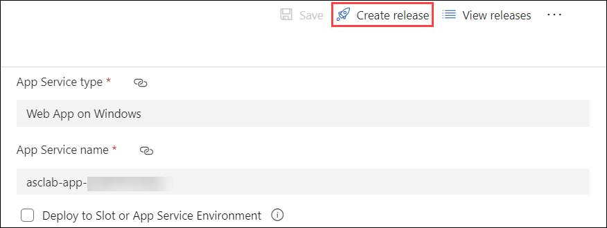

1. Wait until the release pipline successfully completed.

   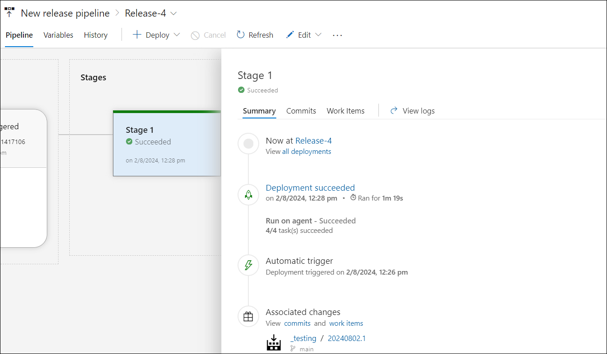

1. Navigate to the Azure portal interface, navigate to the resource group **asclab**, in the list of resources, click the **asclab-app-xxxxxxxxxxxxx** web app.

1. On the web app blade, click **Browse**.

   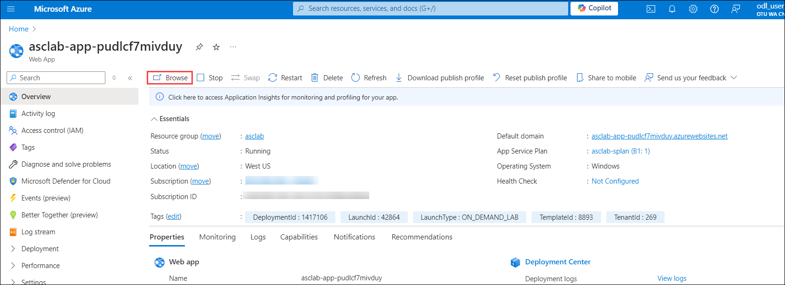

1. Verify that the web page loads successfully in a new web browser tab.

   

## **Task 2: Identifying security issues in the pipeline** 

Integrate Microsoft Security DevOps into your Azure DevOps pipeline to scan Infrastructure as Code (IaC) templates for security issues. This process ensures early detection of vulnerabilities, enhances compliance, and improves your overall security posture within existing DevOps workflows.

1. On your lab computer, open the Azure DevOps portal with the **Defender_for_cloud** project in a web browser. Click on the **marketplace icon > Browse Marketplace**.

   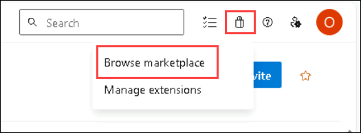

2. Search for **Microsoft Security DevOps** in the Marketplace and open it.

   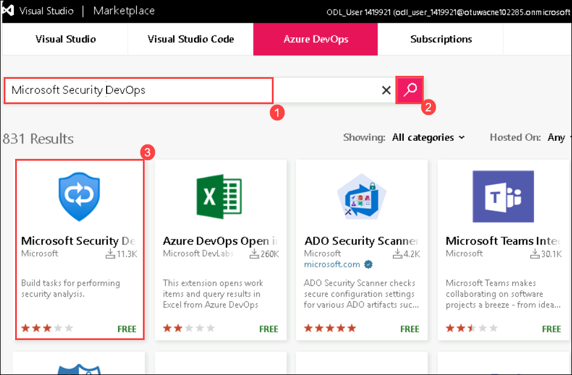

1. On the **Microsoft Security DevOps** page, click on **Get it for free**.

   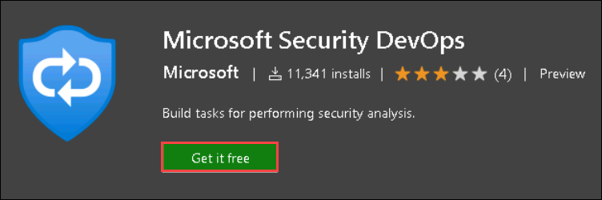

1. Select the desired Azure DevOps organization and **Install**.

   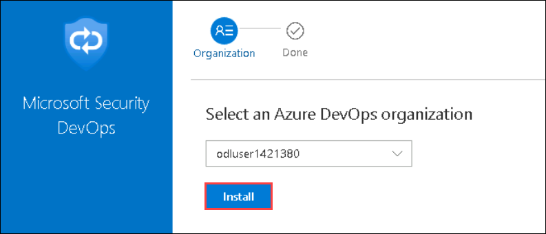

1. Click **Proceed to organization** once the installation is complete.

   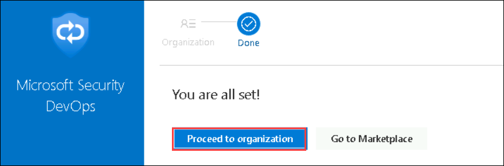

1. Navigate to **Repos (1) > Files (2)**, create a new file named **main.tf**, and add the following content:

   ```hcl
   # Specify the provider
   provider "azurerm" {
   features {}
   }

   # Resource Group
   resource "azurerm_resource_group" "example" {
   name     = "example-resources"
   location = "East US"
   }

   # Virtual Network
   resource "azurerm_virtual_network" "example" {
   name                = "example-vnet"
   address_space       = ["10.0.0.0/16"]
   location            = azurerm_resource_group.example.location
   resource_group_name = azurerm_resource_group.example.name
   }

   # Subnet
   resource "azurerm_subnet" "example" {
   name                 = "example-subnet"
   resource_group_name  = azurerm_resource_group.example.name
   virtual_network_name = azurerm_virtual_network.example.name
   address_prefixes     = ["10.0.1.0/24"]
   }

   # Network Interface
   resource "azurerm_network_interface" "example" {
   name                = "example-nic"
   location            = azurerm_resource_group.example.location
   resource_group_name = azurerm_resource_group.example.name

   ip_configuration {
      name                          = "internal"
      subnet_id                     = azurerm_subnet.example.id
      private_ip_address_allocation = "Dynamic"
   }
   }

   # Virtual Machine
   resource "azurerm_virtual_machine" "example" {
   name                = "example-vm"
   location            = azurerm_resource_group.example.location
   resource_group_name = azurerm_resource_group.example.name
   network_interface_ids = [
      azurerm_network_interface.example.id,
   ]
   vm_size = "Standard_B1s"

   storage_os_disk {
      name              = "myosdisk1"
      caching           = "ReadWrite"
      create_option     = "FromImage"
      managed           = true
      disk_size_gb      = 30
   }

   storage_image_reference {
      publisher = "MicrosoftWindowsServer"
      offer     = "WindowsServer"
      sku       = "2019-Datacenter"
      version   = "latest"
   }

   os_profile {
      computer_name  = "hostname"
      admin_username = "adminuser"
      admin_password = "Password1234!"
   }

   os_profile_windows_config {
      provision_vm_agent = true
   }
   }
   ```

   ### Explanation:
   - **Provider Block**: Specifies the provider (in this case, Azure).
   - **Resource Group**: Defines the resource group where all other resources will reside.
   - **Virtual Network**: Defines a virtual network with a specified address space.
   - **Subnet**: Creates a subnet within the virtual network.
   - **Network Interface**: Creates a network interface card for the VM.
   - **Virtual Machine**: Defines the virtual machine, including the operating system, size, and network settings.

1. Click on **Commit** in the **main.tf** page.

   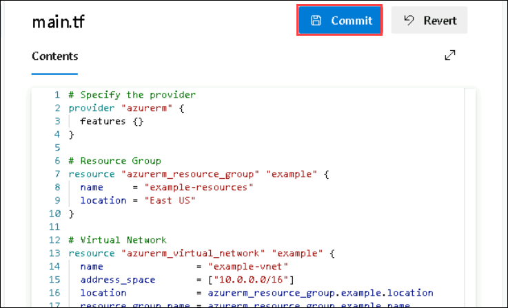

1. Confirm by clicking **Commit** again.

   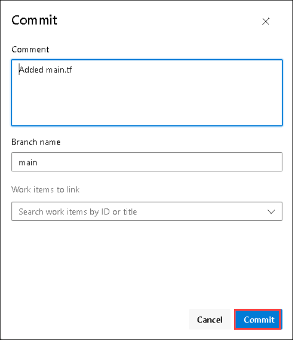

1. Navigate to the **Pipelines** pane in the **Pipelines** hub.

1. Click **New pipeline** in the **Pipeline** window.

1. Select **Azure Repos Git (YAML)** on the **Where is your code?** pane.

   

1. Click **Defender_for_cloud** on the **Select a repository** pane.

   

1. Scroll down and select **Starter pipeline** on the **Configure your pipeline** pane.

   

1. Define your build pipeline in a file named `azure-pipelines.yml` with the following content:

   ```yaml
   trigger:
   - main

   pool:
     vmImage: ubuntu-latest

   steps:
   - task: MicrosoftSecurityDevOps@1
     displayName: 'Microsoft Security DevOps'
     inputs:    
      categories: 'IaC'
   ```
1. This YAML file is designed to configure an Azure DevOps pipeline with the following specifics:

   - **Trigger**: The pipeline is set to `none`, meaning it won't run automatically based on code changes or other triggers. It will need to be started manually or triggered by another pipeline or service.
   - **Pool**: Specifies that the pipeline will use the `windows-latest` virtual machine image. This VM image is provided by Azure DevOps and ensures the pipeline runs on a fresh Windows environment with the latest updates.
   - **Steps**: The pipeline includes a single step:
     - **Task**: Uses the `MicrosoftSecurityDevOps@1` task, which is designed for Microsoft Security DevOps.
     - **Display Name**: The task is labeled 'Microsoft Security DevOps' for easy identification in the pipeline UI.
     - **Inputs**:
       - `categories`: Set to 'IaC', indicating that the task will focus on Infrastructure as Code (IaC) security scanning.

8. Click **Save and Run** then click **Run** to start the Build Pipeline process.

   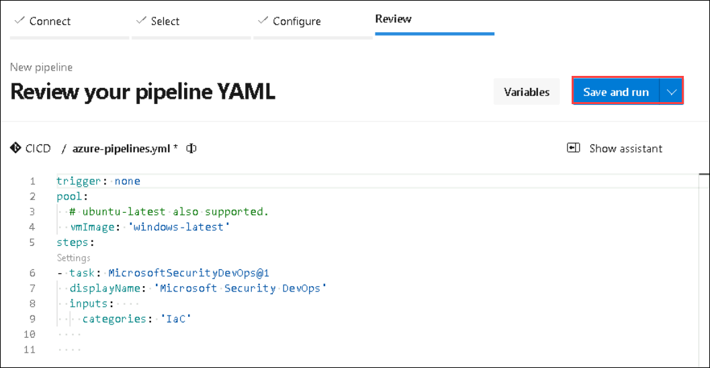

9. Wait for the build pipeline to complete. Once finished, review the results, including any warnings or errors reported by the tasks. Address any issues identified, make the necessary changes, and then rerun the pipeline to ensure that all problems are resolved.
   
   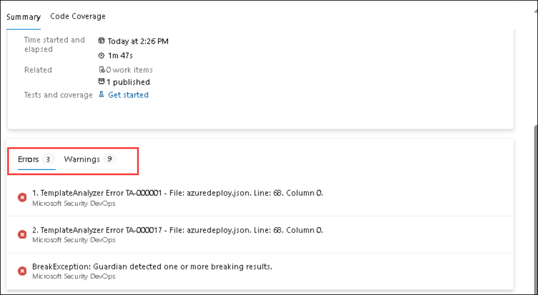

### Benefits of Using Microsoft Security DevOps for Scanning the Pipeline

1. **Early Detection of Security Issues**: Microsoft Security DevOps integrates security scanning directly into your CI/CD pipeline, ensuring that security issues in your IaC templates are identified early in the development process.

2. **Enhanced Compliance**: By incorporating automated security checks, your pipeline remains compliant with industry standards and best practices, reducing the risk of deploying insecure infrastructure.

3. **Improved Security Posture**: Continuous scanning and monitoring of your IaC configurations help maintain a robust security posture by promptly addressing vulnerabilities and misconfigurations.

4. **Streamlined Security Workflows**: Integrating security tools into your existing DevOps workflows simplifies the process of managing and mitigating security risks, reducing manual intervention and enhancing efficiency.

5. **Comprehensive Security Coverage**: Microsoft Security DevOps covers a wide range of security aspects, including code analysis, dependency scanning, and configuration checks, providing comprehensive security coverage for your pipeline.

## **Task 3: Overview of GitHub Advanced Security (GHAS) [Read-Only]**

### Overview of GitHub Advanced Security (GHAS)

GitHub Advanced Security (GHAS) is a suite of security tools built into the GitHub platform designed to help developers secure their code and workflows. It includes features such as code scanning, secret scanning, and dependency review to identify and remediate security vulnerabilities and exposures.

1. Enable GitHub Advanced Security
To use GHAS, you need to have GitHub Advanced Security enabled for your repository. This typically requires a GitHub Enterprise subscription.

- Navigate to your repository on GitHub.
- Click on `Settings`.
- In the `Security` section, find `GitHub Advanced Security` and enable it.

2. Configure Code Scanning

   **Code scanning** helps detect vulnerabilities and errors in your code by running static analysis tools.

- Go to the `Security` tab of your repository.
- Click on `Set up code scanning`.
- You can choose from different options like `CodeQL Analysis`, which is a powerful tool provided by GitHub. Select the `Set up this workflow` button for `CodeQL Analysis`.
- Review the configuration file (e.g., `.github/workflows/codeql-analysis.yml`). Modify it if needed and commit it to your repository.

3. Run Code Scanning

- Once configured, code scanning runs automatically on the specified events (like pushes and pull requests).
- You can also manually trigger a scan by going to the `Actions` tab, finding the `CodeQL` workflow, and clicking `Run workflow`.

4. Review Code Scanning Results

- Navigate to the `Security` tab, and under `Code scanning alerts`, you'll see a list of detected issues.
- Click on any alert to get detailed information about the vulnerability and recommended fixes.

5. Configure Secret Scanning

**Secret scanning** detects secrets (like API keys and tokens) that may have been accidentally committed to your repository.

- Go to the `Security` tab of your repository.
- Click on `Set up secret scanning`.
- GitHub automatically scans for patterns that match common secret types and alerts you if any are found.

6. Review Secret Scanning Results

- Navigate to the `Security` tab, and under `Secret scanning alerts`, you'll see a list of detected secrets.
- Click on any alert to view details and follow the steps to revoke or rotate the compromised secrets.

7. Set Up Dependency Review

**Dependency review** helps you understand and remediate vulnerable dependencies in your project.

- Ensure your project has a dependency manifest file (e.g., `package.json`, `pom.xml`).
- GitHub automatically generates dependency graphs and checks for known vulnerabilities in your dependencies.

8. Review Dependency Alerts

- Navigate to the `Security` tab, and under `Dependency review`, you'll see alerts for vulnerable dependencies.
- Click on any alert to see details about the vulnerability and recommended versions to update to.

9. Manage Security Policies

- In the `Security` tab, you can also manage security policies by setting up a `security.md` file to inform users about your project's security practices and how they can report vulnerabilities.

10. Continuous Monitoring and Alerts

- GitHub Advanced Security continuously monitors your repository and generates alerts for any new issues found.
- Make it a habit to regularly review the `Security` tab and address any new alerts promptly.

## **Task 4: Overview of Defender for DevOps (including pricing) [Read-Only]**

Defender for DevOps is a security solution by Microsoft designed to enhance the security of DevOps environments. It provides a range of tools and features to help secure the software development lifecycle (SDLC) and protect against threats that target DevOps processes. Here's an overview:

### Overview of Microsoft Defender for DevOps

**Microsoft Defender for DevOps** helps secure your DevOps environments and pipelines by integrating with popular DevOps tools and providing security recommendations for your code and infrastructure. It focuses on the following areas:

1. **Source Code Security**: Scans your code repositories to identify vulnerabilities and security issues in your source code.
2. **Pipeline Security**: Monitors and protects your CI/CD pipelines from potential threats and unauthorized access.
3. **Infrastructure as Code (IaC) Security**: Analyzes your IaC templates (e.g., Terraform) for potential security risks and misconfigurations.

**Key Features:**
- **Integration**: Works with tools like GitHub, Azure DevOps, and Bitbucket.
- **Vulnerability Scanning**: Identifies vulnerabilities in your code, dependencies, and configuration files.
- **Security Recommendations**: Provides actionable insights and recommendations for securing your pipelines and code.
- **Compliance**: Helps ensure compliance with industry standards and best practices.

### Pricing

The pricing for Microsoft Defender for DevOps is generally included as part of the broader Microsoft Defender for Cloud offering, specifically under **Defender for Cloud's Cloud Security Posture Management (CSPM)** plan. Here’s a general breakdown:

- **Microsoft Defender for Cloud (Free Tier)**: Basic security features, including Azure Security Center and Azure Defender for servers.
- **Microsoft Defender for Cloud (Standard Tier)**: Includes advanced features such as Defender for DevOps, Defender for Cloud's comprehensive protection, and threat detection capabilities. 

For exact pricing details, especially as they can vary based on the size of the environment and specific needs, it's best to consult the [Microsoft Defender for Cloud pricing page](https://azure.microsoft.com/en-us/pricing/details/defender-for-cloud/) or contact Microsoft sales for a customized quote.

### Inclusion in Defender for CSPM

**DevOps Security Posture** is included as part of the **Defender for CSPM** plan, which provides a unified view of your security posture across various cloud environments, including DevOps. This integration means that DevOps security capabilities are seamlessly integrated into the overall cloud security management, offering a more comprehensive approach to securing both your cloud infrastructure and development workflows.

## **Task 5: Securing your pipeline with GHAS**

To secure your pipeline with GitHub Advanced Security (GHAS) and Microsoft Defender for DevOps, you can integrate these tools to enhance your pipeline's security posture. Here’s a example of how to use GHAS and Defender for DevOps for security:

#### Configure the eShopOnWeb team project in Azure DevOps

1. Navigate to **azuredevopsdemogenerator** using the link below. This utility site will automate the process of creating a new Azure DevOps project within your account that is prepopulated with content (work items, repos, etc.) required for the lab. For more information on the site, please see [https://docs.microsoft.com/en-us/azure/devops/demo-gen](https://docs.microsoft.com/en-us/azure/devops/demo-gen).

   ```
   https://azuredevopsdemogenerator.azurewebsites.net/
   ```
  
1. Click on **Sign in** and log in using the Microsoft account associated with your Azure DevOps subscription.

    

1. Please click on **Accept** to grant permission to access your subscription.

1. Click **Choose Template**.

    

1. Select the **eShopOnWeb (1)** template and click on **Select Template (2)**.

    

1. Provide a project name, **eShopOnWeb (1)**, and choose your **Organization (2)**, then click on **Create Project (3)** and wait for the process to complete.

   

1. Once the process is complete, click on **Navigate to project**.

   

#### Enable Advanced Security from Portal

GitHub Advanced Security for Azure DevOps includes extra permissions for more levels of control around Advanced Security results and management. Be sure to adjust individual permissions for your repository.

To ensure Azure DevOps Advanced Security is enabled in your organization, you can follow these steps:

1. Click **Project settings (1)** in the lower-left corner. In the left menu under Repos, click **Repositories (2)**, then select the **eShopOnWeb (3)** repository.

   .png)

1. Click on **Settings (1)**, then click on **Advanced Security (2)**, to turn it **On** and click **Enable all**.

    .png)

1. Click **Begin Billing**.

    

1. Advanced Security and Push Protection are now enabled. You can also onboard Advanced Security at [Project-level](https://learn.microsoft.com/en-us/azure/devops/repos/security/configure-github-advanced-security-features?view=azure-devops&tabs=yaml#project-level-onboarding) and [Organization-level](https://learn.microsoft.com/en-us/azure/devops/repos/security/configure-github-advanced-security-features?view=azure-devops&tabs=yaml#organization-level-onboarding) as well but we recommend for this hands on lab to enable it only for repositry level.

#### Update the pipeline and create a pull request

In this task, you will remove the Azure deployment task codes from the pipeline.

1. Navigate to the **Pipelines (1)** in the left menu and select the **eShopOnWeb (2)** pipeline.

   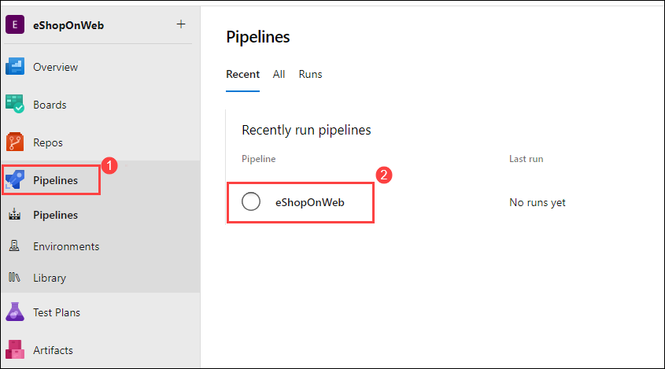

1. Click on **Edit** on top right corner.

   

1. Make sure you **Remove** the code in the pipeline which includes the **test** and **production** deployments tasks (from line 70 till the end). If you won't remove the deployment task the pipeline might fail.

1. The final code should look like the one below

   ```
    trigger:
    - main
    
    pool:
      vmImage: ubuntu latest
    
    extends: 
      template: template.yaml
      parameters:
        stages:
          - stage: Build
            displayName: 'Build'
            jobs:
            - job: Build
              steps:
              - checkout: self
    
              - task: DotNetCoreCLI@2
                displayName: Restore 
                inputs:
                  command: restore
                  projects: '**/*.csproj'
    
              - task: ms.advancedsecurity-tasks.codeql.init.AdvancedSecurity-Codeql-Init@1
                condition: and(succeeded(), ne(variables['Build.Reason'], 'PullRequest'))
                displayName: 'Initialize CodeQL'
                inputs:
                  languages: csharp
                  querysuite: default
    
              - task: DotNetCoreCLI@2
                displayName: Build
                inputs:
                  projects: '**/*.csproj'
                  arguments: '--configuration $(BuildConfiguration)'
    
              - task: ms.advancedsecurity-tasks.dependency-scanning.AdvancedSecurity-Dependency-Scanning@1
                condition: and(succeeded(), ne(variables['Build.Reason'], 'PullRequest'))
                displayName: 'Dependency Scanning'
    
              - task: ms.advancedsecurity-tasks.codeql.analyze.AdvancedSecurity-Codeql-Analyze@1
                condition: and(succeeded(), ne(variables['Build.Reason'], 'PullRequest'))
                displayName: 'Perform CodeQL analysis'
    
              - task: ms.advancedsecurity-tasks.codeql.enhance.AdvancedSecurity-Publish@1
                condition: and(succeeded(), ne(variables['Build.Reason'], 'PullRequest'))
                displayName: 'Publish Results'
    
              - task: DotNetCoreCLI@2
                displayName: Test
                inputs:
                  command: test
                  projects: '[Tt]ests/**/*.csproj'
                  arguments: '--configuration $(BuildConfiguration) --collect:"Code coverage"'
    
              - task: DotNetCoreCLI@2
                displayName: Publish
                inputs:
                  command: publish
                  publishWebProjects: True
                  arguments: '--configuration $(BuildConfiguration) --output $(build.artifactstagingdirectory)'
                  zipAfterPublish: True
    
              - task: PublishBuildArtifacts@1
                displayName: 'Publish Artifact'
                inputs:
                  PathtoPublish: '$(build.artifactstagingdirectory)'
                condition: succeededOrFailed()
    ```
     
1. Click on **Validate and save**.

   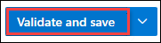

1. Select **Create a new branch for this commit**, keep the default value, and click **Save**. Finally, click **Run**.

   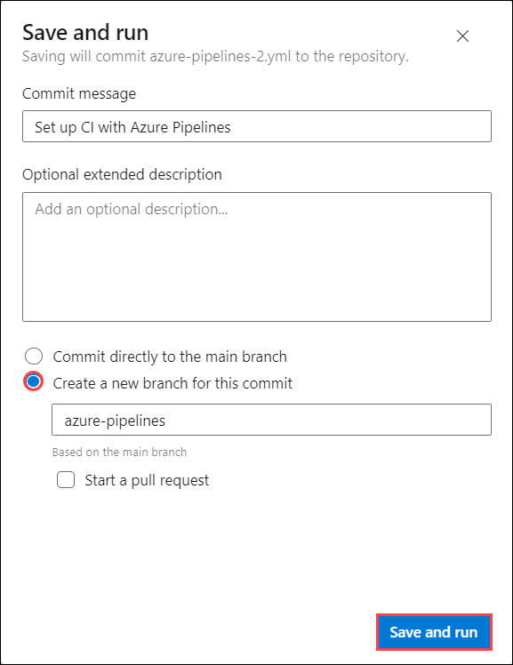

1. Navigate to the pipeline and select it. The execution may take approximately 5 minutes to complete, so please wait until the build finishes.

## **Task 6: Integrating non-MS security scan solutions with MDC**

Integrating non-Microsoft security scan solutions with Microsoft Defender for Cloud (MDC) enhances your security posture comprehensively. 

To incorporate a security scan into your Azure DevOps pipeline with minimal configuration, follow these steps for a basic integration using **Snyk**:

### Security Scan with Snyk

**Snyk** is a well-known tool for vulnerability scanning in open source dependencies. Here’s how to integrate Snyk into your Azure DevOps pipeline to identify security issues:

1. **Go to [Snyk's website](https://snyk.io/).**

1. **Click on "Start free"** or **"Sign up"** located on the left of the page.
    
   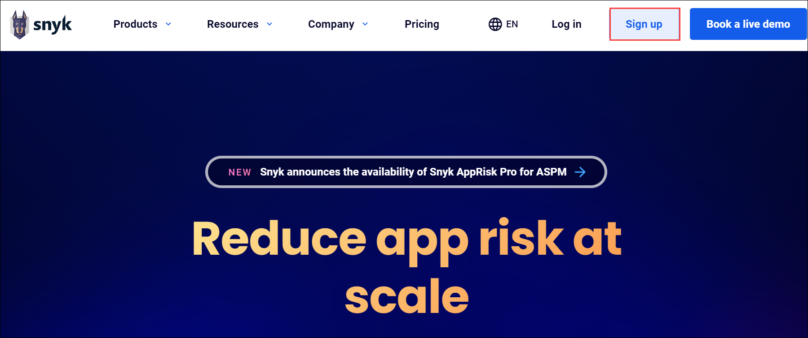

1. On the sign-up page, **select the "Sign up with GitHub"** option.

   

1. **Authorize Snyk** to access your GitHub account by clicking "Authorize Snyk" on the GitHub authorization page.

1. Follow the remaining prompts to complete your account setup.

   >**Note**: On **where is the code you want to scan** page, select **skip for now**.

1. Access your **Snyk account settings** to retrieve your **API token for authentication** and record it in your notepad.
 
   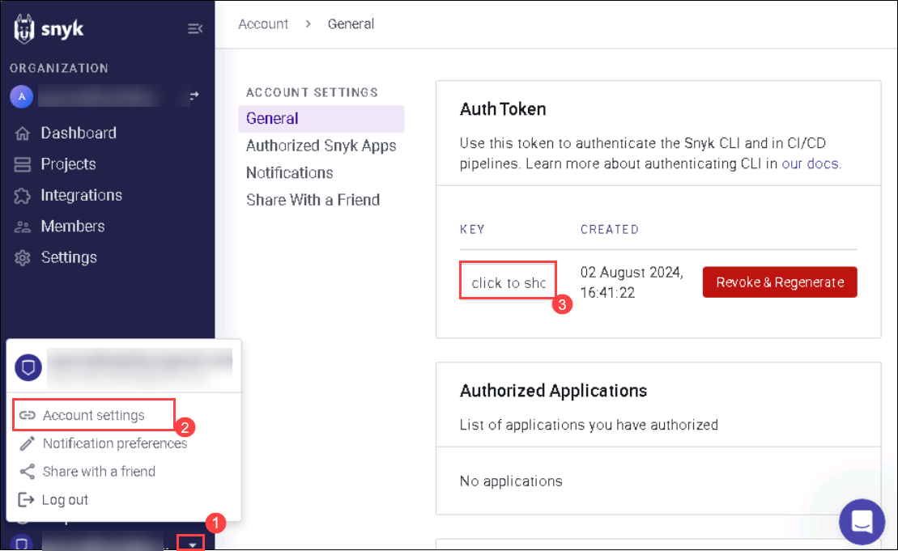

1. On your lab computer, open the Azure DevOps portal with the **Defender_for_cloud** project in a web browser. Click on the **marketplace icon > Browse Marketplace**.

   

1. Search for **Snyk Security Scan** in the Marketplace and open it.

   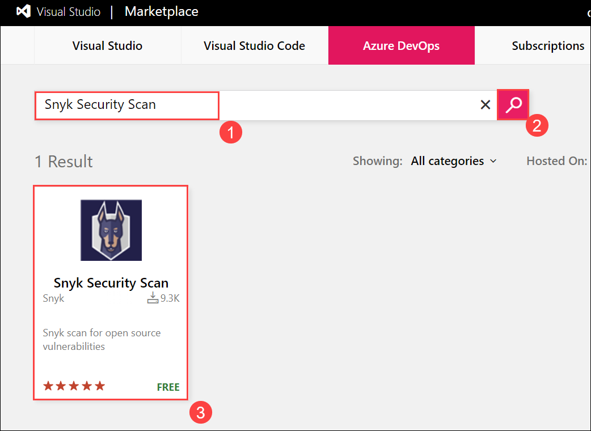

1. On the **Microsoft Security DevOps** page, click on **Get it for free**.

   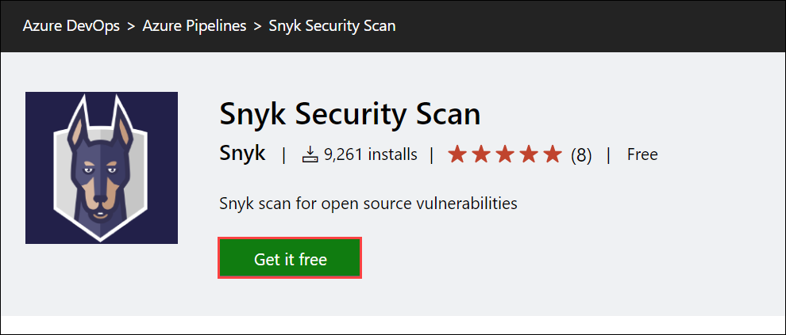

1. Select the desired Azure DevOps organization and **Install**.

   

1. Click **Proceed to organization** once the installation is complete.

   

1. Go to the Azure portal, search for **Entra ID (1)**, and select **Microsoft Entra ID (2)**.

   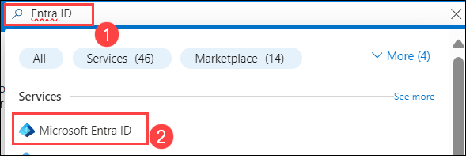

1. Scroll down and select **App registrations** under **manage**, then select the app registration named **odluser1420823-Defender_for_cloud-suffix** under all application.

   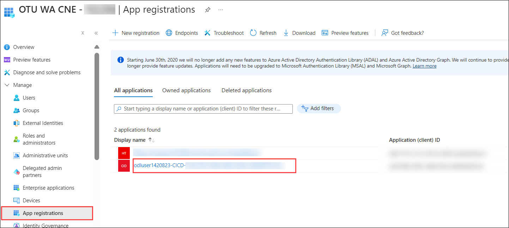

1. Copy the name of the app registration and paste it into your notepad.

   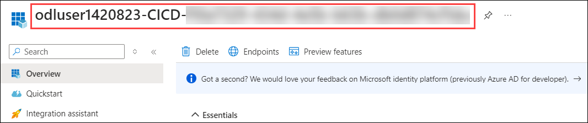

1. Navigate back to Azure DevOps and click on **Project Settings** at the bottom left of the **Defender_for_cloud** project.

1. Scroll down on the **Project Settings** page and select **Service Principal.**

   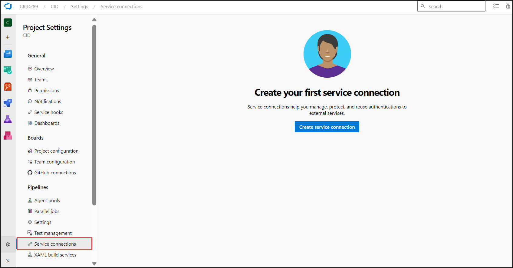

1. Click on **New Service Principal.**

   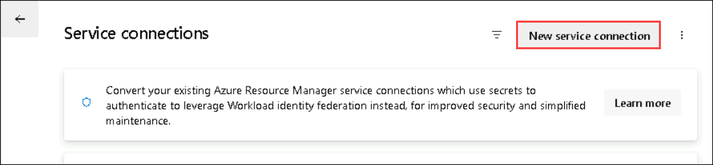

1. Search for and select **Snyk Authentication**, then click **Next**.

   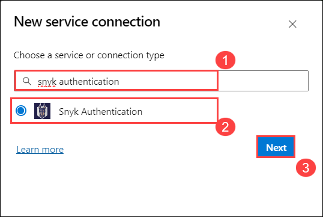

1. Paste the **API** under **Snyk API Token (1)** and the **App registration** name under **Service connection name (2)** that you noted earlier. Then, click **Save (3)**.

   

1. You should see that a new service principal has been created.

   

### 2. Integrate Snyk in Azure DevOps Pipeline

1. Navigate to the **Pipelines** pane in the **Pipelines** hub.

1. Click **New pipeline** in the **Pipeline** window.

1. Select **Azure Repos Git (YAML)** on the **Where is your code?** pane.

   

1. Click **Defender_for_cloud** on the **Select a repository** pane.

   

1. Scroll down and select **Starter pipeline** on the **Configure your pipeline** pane.

   

1. Define your build pipeline in a file named `azure-pipelines.yml` with the following content:

   ```yaml
   trigger:
   - main

   pool:
     vmImage: 'ubuntu-latest'

   steps:
   - task: UseNode@1
     inputs:
       version: '14.x'
     displayName: 'Install Node.js'

   - script: |
      npm install -g snyk
     displayName: 'Install Snyk CLI'
   ```

1. Click on the 16th line then press enter.

1. Expand **Task** pane from the right side then search and select **Snyk Security Scan**

   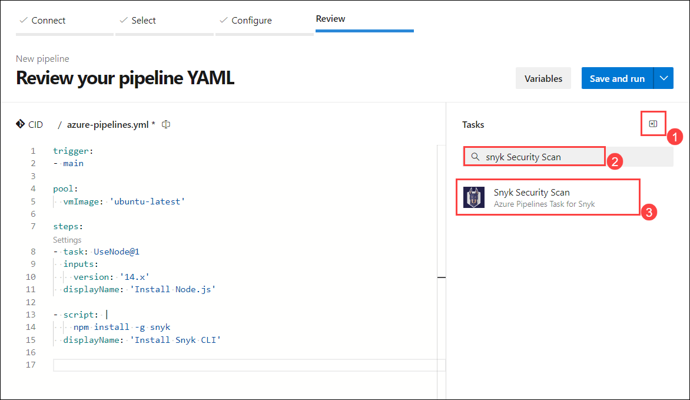

1. Under **Snyk Security Scan**, complete the following steps:

   - For **Snyk API token**, select the API from the dropdown menu.
   - For **What do you want to test**, choose **Code**.
   - For **Project name in Synk**, enter **Synk Security Scan**.
   - Click **Add**.

    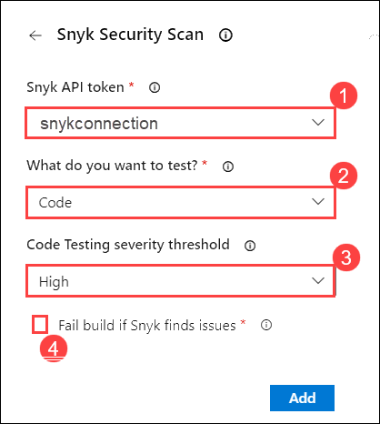

1. Click **Save and Run** then again click **Save and Run** to start the Build Pipeline process.

   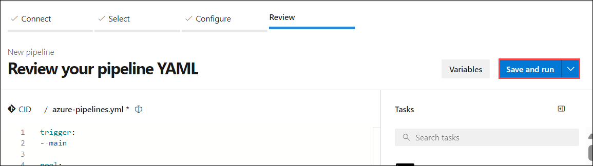

1. You are prompted with **Permissions Needed**, as well as an orange bar saying :

    ```
    This pipeline needs permission to access a resource before this run can continue
    ```

1. Click on **View**.

   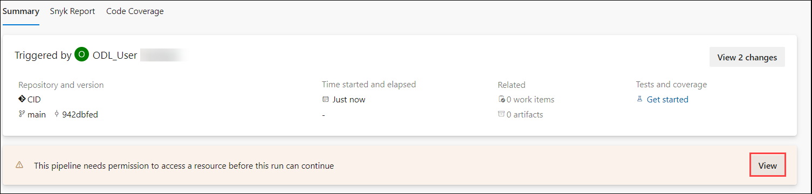

1. From the **Waiting for Review** pane, click **Permit**.

   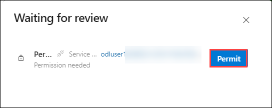

1. Validate the message in the **Permit popup** window, and confirm by clicking **Permit**.

   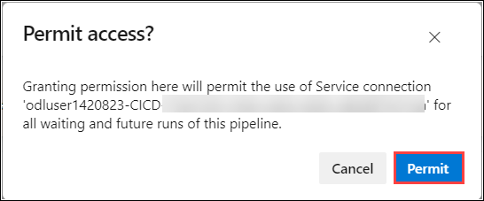

9. Wait for the build pipeline to complete. After running the pipeline, review the results of the Snyk scan in the pipeline logs. Snyk will report any vulnerabilities found.

   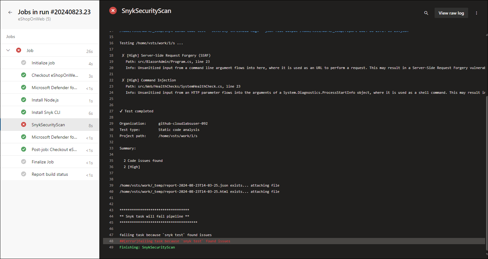

1. Go to the Summary tab, and you will find the **Snyk report** under the *Snyk tab*.

   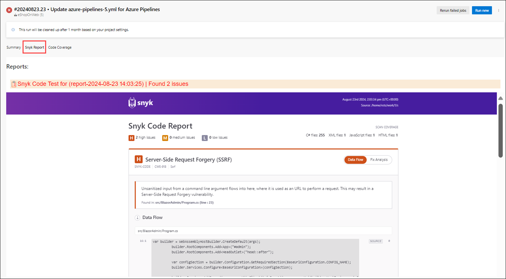

## **Task 7: Connecting and Securing your Azure DevOps environment to MDC**

1. Navigate to Azure portal.

1. Search and select **Microsoft Defender for Cloud** from the portal

   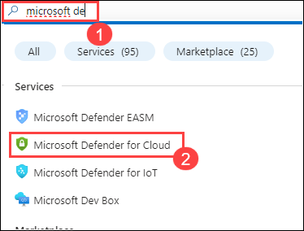

1. Select **skip** on **Getting started** tab.

   

1. Select **Environment settings** under Management > **+Add environment** > **Azure DevOps**

   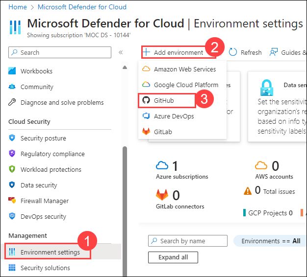

1. On the **Azure DevOps Connection** page, under **Account details**, provide the below settings.

   | Setting  | Value |
   -----------|---------
   | Connector name | AzureDevopsconnector |
   | Subscription | Choose the default subscription |
   | Resource group | defenderforcloud |
   | Location | east us|

   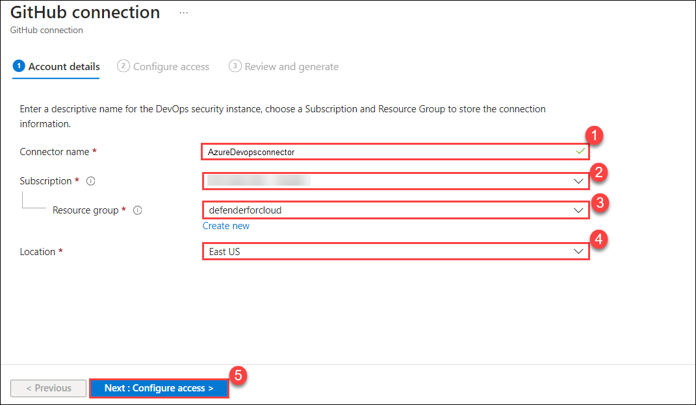

1. Select **Next: Configure access**

1. Select **Authorize**. Ensure you're authorizing the correct Azure Tenant using the drop-down menu in Azure DevOps and by verifying you're in the correct Azure Tenant in Defender for Cloud.

1. In the popup dialog, read the list of permission requests, and then select **Accept**.

   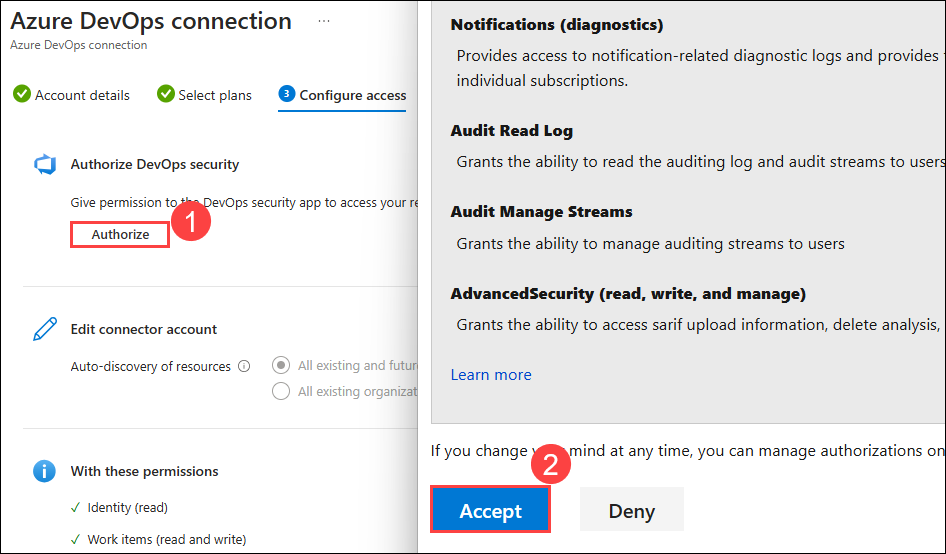

1. Leave all other settings as default.

1. Select **Next: Review and generate**.

1. Review the information, and then select **Create**.

1. Wait for some time to view the connector on the **Environment settings** page.

1. Navigate to **DevOps Security** under **Cloud Security**.

   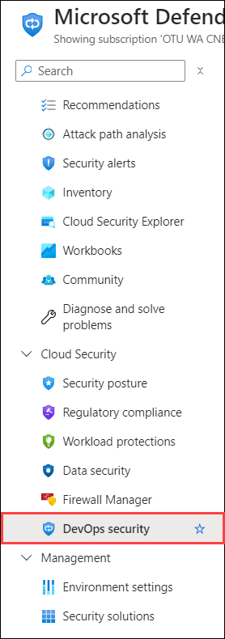

1. The **DevOps security findings** and **DevOps security results** are listed on the page, which helps to review the DevOps security posture.

   

   >**Note:** It might take upto 8hrs to reflect the real-time status.

1. Navigate to **DevOps workbook** and change the toggle to **Yes**, which provides an overview of the tabs provided below

   

   

1. Navigate to the **Infrastructure as Code** tab and scroll down, click on the **Severity** section to open the individual findings, and click on **Information** which in turn provides detailed findings and the issue location.

   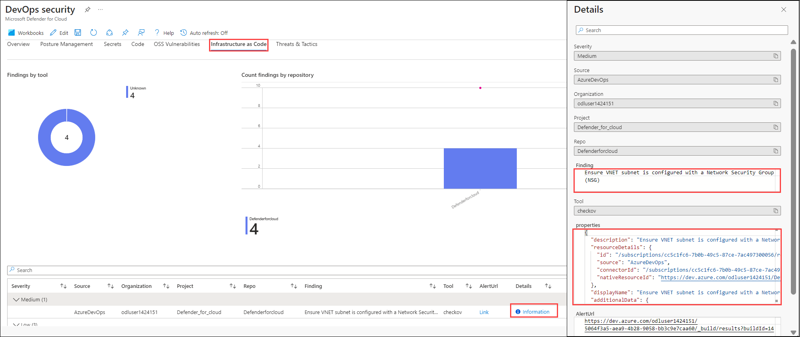

1. Similarly, navigate to the **Secrete** tab and click on **link** and identify the issues.

   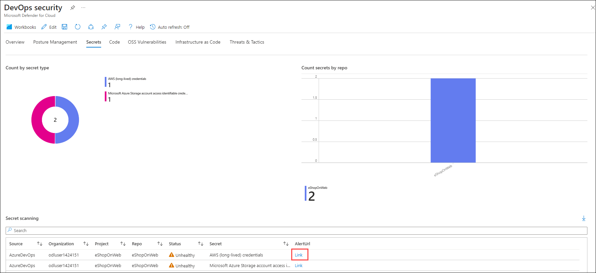

1. Then take note of the recommendations provided to resolve the issues.

   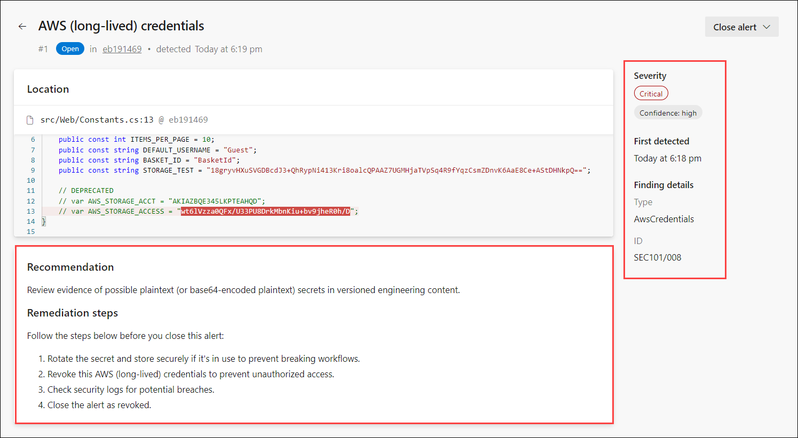


## **Task 8: Role of Defender Cloud Security Posture Management (DCSPM)** 

DevOps Security Posture, as part of Cloud Security Posture Management (CSPM), involves assessing and enhancing the security of your development and deployment processes within the cloud. Here's a detailed discussion on what CX (Customer Experience) gets in terms of DevOps security posture within CSPM:

### 1. Overview of CSPM and DevOps Security

CSPM focuses on ensuring that your cloud environment adheres to security best practices and compliance requirements. It helps in identifying misconfigurations, vulnerabilities, and compliance issues within your cloud resources. When integrated with DevOps processes, CSPM aims to secure the entire development lifecycle from code to deployment.

### 2. Key Aspects of DevOps Security Posture in CSPM

- **Infrastructure as Code (IaC) Scanning**: CSPM solutions often include the ability to scan IaC templates for security vulnerabilities and misconfigurations before they are deployed. This ensures that any security issues are identified early in the development process, reducing the risk of deploying insecure configurations.

- **Continuous Integration/Continuous Deployment (CI/CD) Pipelines Security**: CSPM tools can monitor and secure CI/CD pipelines to ensure that the processes involved in building, testing, and deploying applications are secure. This includes checking for vulnerabilities in the build environment, ensuring secure access controls, and monitoring the integrity of the deployment process.

- **Compliance Monitoring**: CSPM solutions can help ensure that your DevOps processes comply with industry standards and regulations. This includes monitoring for adherence to policies like GDPR, HIPAA, or PCI-DSS within your development and deployment practices.

- **Threat Detection and Response**: Advanced CSPM tools provide real-time threat detection and response capabilities. They can identify suspicious activities or potential security incidents in your DevOps processes and provide recommendations for remediation.

- **Configuration Management**: Ensuring that configurations used in development, staging, and production environments are securely managed and adhere to best practices is a critical aspect of DevOps security posture. CSPM tools help in monitoring and enforcing secure configurations across all environments.

### 3. Demonstrating DevOps Security Posture

To showcase the DevOps security posture provided by CSPM, you can create a lab or demonstration that highlights the following:

- **IaC Scanning**: Show how CSPM tools can scan Terraform or other IaC templates for security issues. Demonstrate how vulnerabilities are identified and how they can be fixed before deployment.

- **Pipeline Security**: Set up a demo of a CI/CD pipeline integrated with CSPM tools. Highlight how the tool monitors the pipeline for security issues, such as insecure dependencies or misconfigured pipeline settings.

- **Compliance Checks**: Display how the CSPM solution continuously monitors for compliance with various standards and regulations, providing actionable insights and recommendations.

- **Incident Response**: Simulate a security incident within the DevOps process and demonstrate how the CSPM tool detects and responds to the threat, including the remediation steps.

1. Integrating CSPM with DevOps processes provides a comprehensive approach to securing your development lifecycle, from coding to deployment. By leveraging CSPM tools, you ensure that security is baked into the DevOps process, reducing vulnerabilities and ensuring compliance.

1. Navigate back to the **Recommendations** page of defender for cloud, filter the recommendations by selecting only **Azure DevOps connections**, and then choose the **Azure DevOps repositories should have secrets scanning findings resolved** recommendation.

   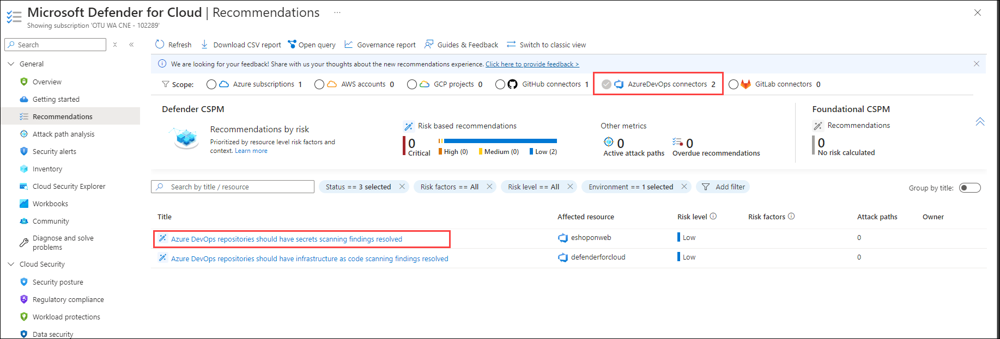

1. Review the **Take actions** tab, where you'll find steps to remediate the issue.

   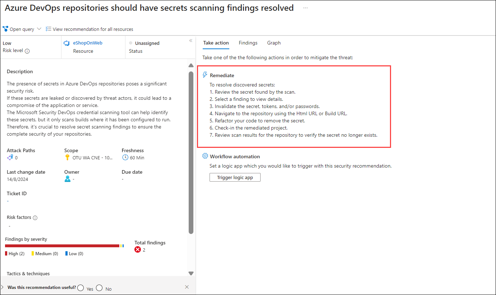

1. Navigate to the **Findings** tab, where you'll find detailed information related to the identified issues.

   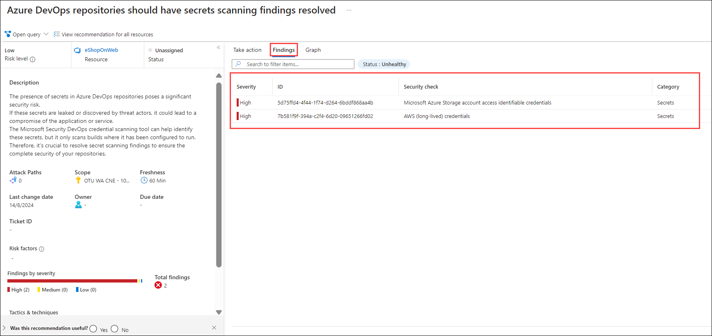

1. Navigate back to the **Recommendations** page, filter the recommendations by selecting only **Azure DevOps connections**, and then choose the **Azure DevOps repositories should have infrastructure as code scanning findings resolved** recommendation.

   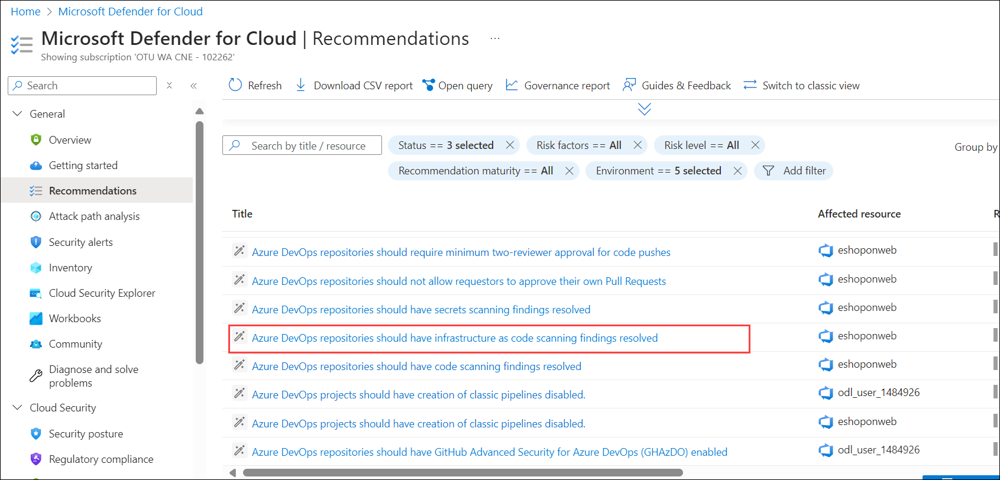

1. Review the **Take actions** tab, where you'll find steps to remediate the issue.

   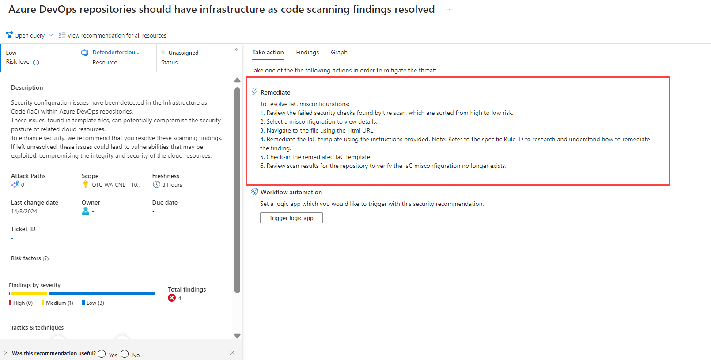

1. Navigate to the **Findings** tab, where you'll find detailed information related to the identified issues.

   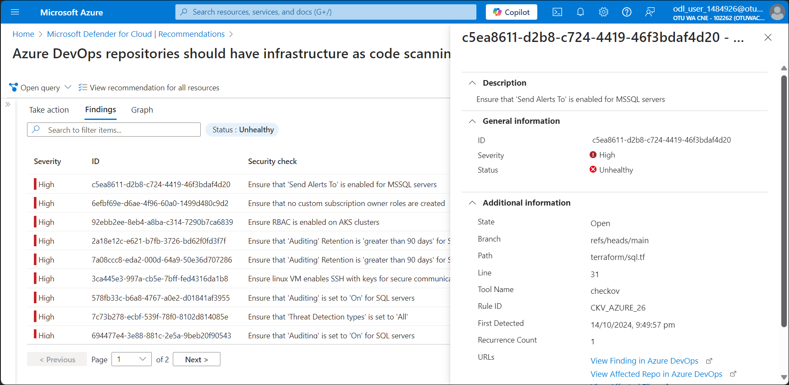

1. Navigate back to the **Recommendations** page, select **Status**, then choose **All (1)**, and click on **Apply (2)**. You'll now see additional recommendations that are in a completed state.

   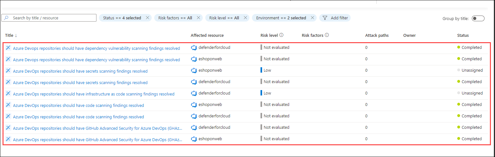