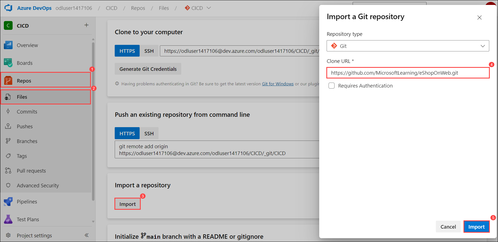
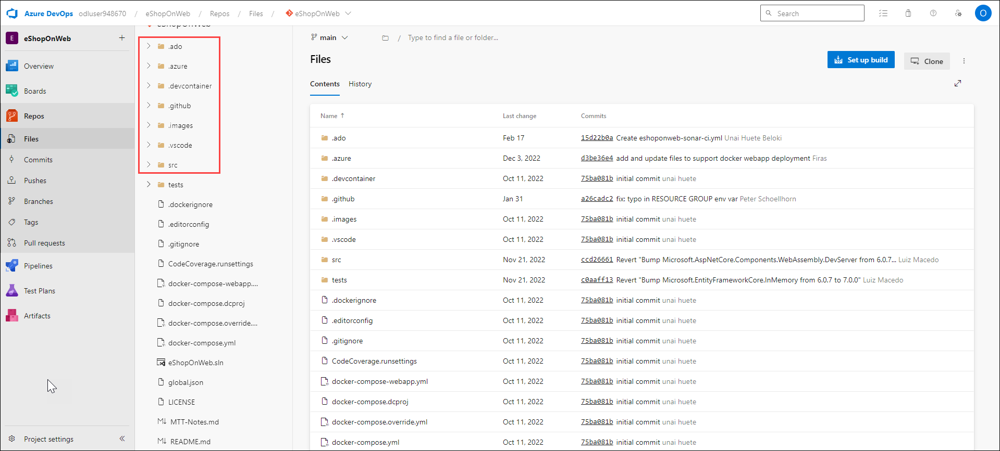

## Module 5 – Defender for DevOps 

## Task 1: Understanding CI/CD pipelines in Azure DevOps 

### Set up an Azure DevOps organization (Skip if already done).

1. On your lab VM open **Edge Browser** on desktop and navigate to [Azure DevOps](https://go.microsoft.com/fwlink/?LinkId=307137), and if prompted sign with the credentials.

    * Email/Username: <inject key="AzureAdUserEmail"></inject>

    * Password: <inject key="AzureAdUserPassword"></inject>

2. If prompted click **Ask later** on **Action Required** page.

3. On the next page accept defaults and click on continue.
   
   
   
4. On the **Almost Done...** page fill the captcha and click on continue. 

   

### Exercise 0: Configure the lab prerequisites

In this exercise, you will set up the prerequisites for the lab, which consist of a new Azure DevOps project with a repository based on the **eShopOnWeb**.

#### Task 1: Create and configure the team project

In this task, you will create an **eShopOnWeb** Azure DevOps project to be used by several labs.

   1. On your lab computer, in a browser window open your Azure DevOps organization. Click on **New Project**. Give your project the name  **eShopOnWeb (1)**, select visibility as **Private(2)**  and leave the other fields with defaults. Click on **Create project (3)**.

      

#### Task 2: Import eShopOnWeb Git Repository

  In this task you will import the eShopOnWeb Git repository that will be used by several labs.
  
   1. On your lab computer, in a browser window open your Azure DevOps organization and the previously created eShopOnWeb project. Click on             **Repos (1)>Files (2) , Import a Repository**. Select **Import (3)**. On the **Import a Git Repository (4)** window, paste the following URL                     https://github.com/MicrosoftLearning/eShopOnWeb.git (5) and click **Import (6)**.

      
      
      

   2. The repository is organized the following way:

         o. **.ado** folder contains Azure DevOps YAML pipelines
         
         o **.devcontainer** folder container setup to develop using containers (either locally in VS Code or GitHub Codespaces)
         
         o **.azure** folder contains Bicep & ARM infrastructure as code templates used in some lab scenarios.
         
         o **.github** folder contains YAML GitHub workflow definitions.
         
         o. **src** folder contains the .NET 6 website used in the lab scenarios.
         
       
         
 ### Exercise 1: Include build validation as part of a Pull Request
 
 In this exercise, you will include build validation to validate a Pull Request.
 
 #### Task 1: Import the YAML build definition
 
 In this task, you will import the YAML build definition that will be used as a Branch Policy to validate the pull requests.
 
 Let's start by importing the build pipeline named **eshoponweb-ci-pr.yml**.
 
   1. Go to **Pipelines (1)>Pipelines (2)**. Click on **Create Pipeline (3)** or **New Pipeline** button.

        

   2. Select **Azure Repos Git (YAML)**

      

   3. Select the **eShopOnWeb** repository.

      

   4. Select **Existing Azure Pipelines YAML File**

      

   5. Select the path **/.ado/eshoponweb-ci-pr.yml(1)** file then click on **Continue(2)**

      

       The build definition consists of the following tasks:
      
         o **DotNet Restore:** With NuGet Package Restore you can install all your project's dependency without having to store them in source                   control. 
        
         o **DotNet Build:** Builds a project and all of its dependencies.
        
         o **DotNet Test:** .Net test driver used to execute unit tests.
        
         o **DotNet Publish:** Publishes the application and its dependencies to a folder for deployment to a hosting system. In this case, it's                 **Build.ArtifactStagingDirectory**.
        
        

   6. Click the **Save** button to save the pipeline definition

      
     
   7. Your pipeline will take a name based on the project name. Let's **rename** it for identifying the pipeline better. Go to **Pipelines>Pipelines** and click on the recently created pipeline. Click on the **ellipsis (1)** and **Rename/move (2)** option.
   
      

   8. Name it **eshoponweb-ci-pr (1)** and click on **Save (2)**.

          

#### Task 2: Branch Policies

In this task, you will add policies to the main branch and only allow changes using Pull Requests that comply with the defined policies. You want to ensure that changes in a branch are reviewed before they are merged.

   1. Go to **Repos (1)>Branches (2)** section. On the **Mine** tab of the **Branches** pane, hover the mouse pointer over the **main (3)** branch entry to reveal the **ellipsis symbol (4)** on the right side.

      

   2. Click the **ellipsis (4)** and, in the pop-up menu, select **Branch Policies (5)**.

      

   3. On the main tab of the repository settings, enable the option for **Require minimum number of reviewers (1)**. Add **1 (2)** reviewer and check the box **Allow requestors to approve their own changes (3)**(as you are the only user in your project for the lab)

      

   4. On the **main (1)** tab of the repository settings, in the **Build Validation (2)** section, **click + (Add a new build policy) (3)** and in the Build pipeline list, select **eshoponweb-ci-pr (4)** then click **Save (5)**

      

      
      
      >**Note**: If you get any error while saving the branch validation refresh the page and try again.

 #### Task 3: Working with Pull Requests
 
 In this task, you will use the Azure DevOps portal to create a Pull Request, using a new branch to merge a change into the protected main branch.
 
 1. Navigate to the **Repos (1)->Branches (2)** section in the eShopOnWeb navigation and click **New Branch (3)**.

    

 2. Create a new branch named **Feature01 (1)** based on the **main** branch and click **Create (2)**.

    

3. Click **Feature01 (1)** and navigate to the **/eShopOnWeb/src(2)/Web(3)/Program.cs (4)** file as part of the **Feature01** branch and click on **edit (5)** to make the following change on the first line:

   ```
   // Testing my PR
   ```

   

   
   
 4. Click on **Commit > Commit** (leave default commit message).

    
    
    

5. A message will pop-up, proposing to create a Pull Request (as your **Feature01** branch is now ahead in changes, compared to **main**). Click on **Create a Pull Request (1)**.

    

6. In the **New pull request (1)** tab, leave defaults and click on **Create (2)**.
   
   
   
7. The Pull Request will show some pending requirements, based on the policies applied to the target **main** branch.

    - It shows **At least 1 user should review and approve the changes (1)**, click **Add (2)** select Required Reviewer and **select the Reviewer to complete the PR(3)**.
    - Build validation, you will see that the build **eshoponweb-ci-pr** was triggered automatically
     
     
     
         
      
8. After all validations are successful, on the top-right click on **Approve (1)**,  click on **Complete (3)**.  

9. On the **Complete Pull Request** tab, select only **Complete associated work items after merging** checkbox  and Click on **Complete Merge**

   

### Exercise 2: Configure CI Pipeline as Code with YAML

  In this exercise, you will configure CI Pipeline as code with YAML.

#### Task 1: Import the YAML build definition

  In this task, you will add the YAML build definition that will be used to implement the Continuous Integration.

  Let's start by importing the CI pipeline named **eshoponweb-ci.yml**.

  1. Go to **Pipelines>Pipelines (1)** and click on **New Pipeline (2)** button

     

  2. Select **Azure Repos Git (YAML)**

      

  3. Select the **eShopOnWeb** repository

     

  4. Select **Existing Azure Pipelines YAML File**

     

  5. Select the **/.ado/eshoponweb-ci.yml (1)** file then click on **Continue (2)**

     

     The CI definition consists of the following tasks:
     
   o **DotNet Restore:** With NuGet Package Restore you can install all your project's dependency without having to store them in source control.
       
   o **DotNet Build:** Builds a project and all of its dependencies.
       
   o **DotNet Test:** .Net test driver used to execute unit tests.
       
   o **DotNet Publish:** Publishes the application and its dependencies to a folder for deployment to a hosting system. In this case, it's             **Build.ArtifactStagingDirectory**.
       
   o **Publish Artifact - Website:** Publish the app artifact (created in the previous step) and make it available as a pipeline artifact.
       
   o **Publish Artifact - Bicep:** Publish the infrastructure artifact (Bicep file) and make it available as a pipeline artifact.
       
              
#### Task 2: Enable Continuous Integration
   
The default build pipeline definition doesn't enable Continuous Integration
   
1. Now, you need to replace the **trigger: none** code with the following code:

   ```
      trigger:
      branches:
         include:
         - main
      paths:
         include:
         - src/web/*
   ``` 

   

   > **Note**: This will automatically trigger the build pipeline if any change is made to the main branch and the web application code (the src/web folder).Since you enabled Branch Policies, you need to pass by a Pull Request in order to update your code. 
    
2. Click the **Dropdown** and **Save** button (not **Save and run**) to save the pipeline definition.

   (1).png)
  
3. Select **Create a new branch for this commit (1)** Keep the default branch name and **Start a pull request(2)** checked. and Click on **Save(3)**

   

4. Your pipeline will take a name based on the project name. Let's **rename** it for identifying the pipeline better. Go to                          **Pipelines>Pipelines** and click on the recently created pipeline. Click on the **ellipsis (1)** and **Rename/move** option. Name it **eshoponweb-ci (2)**  and click on **Save (3)**.

   

5. Go to **Repos (1)>Pullrequests (2)** and click on the existing pull request. After all validations are successful, on the top-right click on **Approve (3)**. Now you can click on **Complete (4)**.

   

6. On the **Complete Pull Request** tab, select only **Complete associated work items after merging** checkbox  and Click on **Complete Merge**

   

#### Task 3: Test the CI pipeline
 
In this task, you will create a Pull Request, using a new branch to merge a change into the protected main branch and automatically trigger the CI pipeline Navigate to the Repos section
 
1. Navigate to the **Repos (1)->Branches (2)** section. Create a **new branch (3)** named **Feature02 (4)** based on the **main** branch and Click on **Create (5)**

   
    
   

2. Click the new **Feature02 (1)** branch and navigate to the **/eShopOnWeb/src (2)/Web (3)/Program.cs (4)** file and click on **Edit (5)** to remove the first line // **Testing my PR (6)** and click on commit.
   
   
   
   

3. Click on **Commit > Commit** (leave default commit message).
   
   

4. A message will pop-up, proposing to create a Pull Request (as your **Feature02** branch is now ahead in changes, compared to main).

5. Click on **Create a Pull Request**

   

6. In the **New pull request (1)** tab, leave defaults and click on **Create (3)** The Pull Request will show some pending requirements, based on the policies applied to the target **main (2)** branch and wait until build completes.

   

7. After all validations are successful, on the top-right click on **Approve (1)**, click on **Complete (2)**

   

8. On the **Complete Pull Request** tab, select only **Complete associated work items after merging** checkbox  and Click on **Complete Merge**

   

9. Go back to **Pipelines>Pipelines,** you will notice that the build **eshoponweb-ci** was triggered automatically after the code was merged.

   
 
10. Click on the **eshoponweb-ci** build then select the last run.

      

11. After its successful execution, click on **Related (1) > Published (2)** to check the published artifacts:
           
       
     
      o Bicep: the infrastructure artifact  
      o Website: the app artifact
     
     


## Task 2: Identifying security issues in the pipeline 


## Task 3: Overview of GitHub Advanced Security (GHAS) [Read-Only] 

### Overview of GitHub Advanced Security (GHAS)

GitHub Advanced Security (GHAS) is a suite of security tools built into the GitHub platform designed to help developers secure their code and workflows. It includes features such as code scanning, secret scanning, and dependency review to identify and remediate security vulnerabilities and exposures.

### Step-by-Step Guide to GitHub Advanced Security

#### 1. **Enable GitHub Advanced Security**
To use GHAS, you need to have GitHub Advanced Security enabled for your repository. This typically requires a GitHub Enterprise subscription.

- Navigate to your repository on GitHub.
- Click on `Settings`.
- In the `Security` section, find `GitHub Advanced Security` and enable it.

#### 2. **Configure Code Scanning**

**Code scanning** helps detect vulnerabilities and errors in your code by running static analysis tools.

- Go to the `Security` tab of your repository.
- Click on `Set up code scanning`.
- You can choose from different options like `CodeQL Analysis`, which is a powerful tool provided by GitHub. Select the `Set up this workflow` button for `CodeQL Analysis`.
- Review the configuration file (e.g., `.github/workflows/codeql-analysis.yml`). Modify it if needed and commit it to your repository.

#### 3. **Run Code Scanning**

- Once configured, code scanning runs automatically on the specified events (like pushes and pull requests).
- You can also manually trigger a scan by going to the `Actions` tab, finding the `CodeQL` workflow, and clicking `Run workflow`.

#### 4. **Review Code Scanning Results**

- Navigate to the `Security` tab, and under `Code scanning alerts`, you'll see a list of detected issues.
- Click on any alert to get detailed information about the vulnerability and recommended fixes.

#### 5. **Configure Secret Scanning**

**Secret scanning** detects secrets (like API keys and tokens) that may have been accidentally committed to your repository.

- Go to the `Security` tab of your repository.
- Click on `Set up secret scanning`.
- GitHub automatically scans for patterns that match common secret types and alerts you if any are found.

#### 6. **Review Secret Scanning Results**

- Navigate to the `Security` tab, and under `Secret scanning alerts`, you'll see a list of detected secrets.
- Click on any alert to view details and follow the steps to revoke or rotate the compromised secrets.

#### 7. **Set Up Dependency Review**

**Dependency review** helps you understand and remediate vulnerable dependencies in your project.

- Ensure your project has a dependency manifest file (e.g., `package.json`, `pom.xml`).
- GitHub automatically generates dependency graphs and checks for known vulnerabilities in your dependencies.

#### 8. **Review Dependency Alerts**

- Navigate to the `Security` tab, and under `Dependency review`, you'll see alerts for vulnerable dependencies.
- Click on any alert to see details about the vulnerability and recommended versions to update to.

#### 9. **Manage Security Policies**

- In the `Security` tab, you can also manage security policies by setting up a `security.md` file to inform users about your project's security practices and how they can report vulnerabilities.

#### 10. **Continuous Monitoring and Alerts**

- GitHub Advanced Security continuously monitors your repository and generates alerts for any new issues found.
- Make it a habit to regularly review the `Security` tab and address any new alerts promptly.

### Best Practices

- Regularly update your workflows and dependency manifests to leverage the latest security updates and fixes.
- Educate your team about security best practices and ensure they follow secure coding guidelines.
- Use branch protection rules and required status checks to enforce code quality and security standards before merging pull requests.
- Keep your secrets and tokens out of the codebase by using environment variables and GitHub Secrets.

By following these steps and best practices, you can effectively utilize GitHub Advanced Security to enhance the security of your code and workflows.

## Task 4: Overview of Defender for DevOps (including pricing) [Read-Only] 

### Overview of Microsoft Defender for DevOps

Microsoft Defender for DevOps is a comprehensive security solution designed to protect your DevOps environments, including CI/CD pipelines, code repositories, and infrastructure as code (IaC) configurations. It helps identify and remediate vulnerabilities, enforce security policies, and secure the entire DevOps lifecycle.

#### 1. **Set Up Microsoft Defender for DevOps**

To start using Microsoft Defender for DevOps, you need to have the appropriate Azure subscription and ensure that the Azure Security Center is enabled.

- Navigate to the Azure portal.
- Search for and select `Microsoft Defender for Cloud`.
- Click on `Environment settings`.
- Select the subscription or workspace where you want to enable Defender for DevOps.
- Enable Microsoft Defender for DevOps.

#### 2. **Integrate with DevOps Tools**

Integrate Defender for DevOps with your CI/CD pipelines and code repositories to start scanning for vulnerabilities.

**Azure DevOps:**

- In the Azure DevOps portal, go to `Project Settings`.
- Under `Pipelines`, select `Service connections`.
- Click on `New service connection` and choose `Azure Resource Manager`.
- Follow the prompts to authorize and configure the service connection.

**GitHub:**

- In the GitHub repository, navigate to `Settings`.
- Under `Security`, select `Integrations`.
- Click on `Configure` next to Microsoft Defender for DevOps and follow the instructions to complete the integration.

#### 3. **Configure Security Policies**

Set up security policies to define the security requirements and best practices for your DevOps environment.

- In the Azure portal, go to `Microsoft Defender for Cloud`.
- Select `Security policy`.
- Choose the subscription or resource group where you want to apply the policy.
- Configure the policy settings according to your security requirements.

#### 4. **Enable Continuous Assessment**

Enable continuous assessment to automatically scan your DevOps pipelines and code repositories for security vulnerabilities.

- In the Azure portal, go to `Microsoft Defender for Cloud`.
- Under `Defender plans`, enable continuous assessment for your DevOps environment.
- Configure the settings to define the scope and frequency of the assessments.

#### 5. **Monitor and Review Security Alerts**

Monitor the security alerts generated by Defender for DevOps to identify and remediate vulnerabilities.

- Navigate to `Microsoft Defender for Cloud` in the Azure portal.
- Go to `Security alerts` to view the list of detected security issues.
- Click on any alert to get detailed information about the vulnerability and recommended remediation steps.

#### 6. **Remediate Vulnerabilities**

Follow the remediation recommendations provided by Defender for DevOps to fix the detected vulnerabilities.

- Review the alert details to understand the nature of the vulnerability.
- Implement the suggested fixes in your code, configuration files, or pipeline settings.
- Rescan the environment to ensure the vulnerabilities have been addressed.

#### 7. **Implement Best Practices**

Adopt security best practices to minimize the risk of vulnerabilities in your DevOps environment.

- Use secure coding practices and code review processes to identify potential security issues early.
- Regularly update dependencies and use vulnerability management tools to keep your environment secure.
- Implement access controls and least privilege principles to protect sensitive data and resources.
- Use Infrastructure as Code (IaC) security tools to scan and validate your IaC templates.

### Pricing

The pricing for Microsoft Defender for DevOps is typically based on the number of resources being monitored and the volume of data processed. Here is an overview of the pricing components:

- **Base Pricing:** There might be a base fee associated with enabling Defender for DevOps, depending on the Azure subscription plan.
- **Resource Monitoring:** Charges are based on the number of resources (e.g., virtual machines, containers) being monitored.
- **Data Ingestion:** Costs for the volume of data processed and analyzed by Defender for DevOps.
- **Alerting and Reporting:** Some plans may include charges for advanced alerting and reporting features.

To get detailed and up-to-date pricing information, you can refer to the [Microsoft Defender for DevOps pricing page](https://azure.microsoft.com/en-us/pricing/details/defender-for-cloud/) on the Azure website.

By following these steps, you can effectively utilize Microsoft Defender for DevOps to secure your DevOps environment and ensure the security of your CI/CD pipelines and code repositories.

## Task 5: Securing your pipeline with GHAS and Defender for DevOps  

## Task 6: Connecting your Azure DevOps environment to MDC 

To connect your Azure DevOps environment to Microsoft Defender for Cloud, you can follow these steps:

1. **Sign in to the Azure Portal**:
   - Go to the Azure portal and navigate to Microsoft Defender for Cloud > Environment settings.
   - Select "Add environment" and then choose "Azure DevOps."

2. **Configure Connection Details**:
   - Enter a name for the connection, select your subscription, resource group, and region.
   - Click "Next: Configure access" and then select "Authorize." Ensure you're authorizing the correct Azure Tenant.

3. **Set Permissions**:
   - Make sure you have the required permissions, which include being an Account Administrator, Contributor, and Project Collection Administrator on the Azure DevOps organization. Basic or Basic + Test Plans access level is needed, and OAuth must be enabled.

4. **Authorize and Complete Setup**:
   - In the popup dialog, read the permission requests, and then select "Accept."
   - Choose the organizations you want to connect. You can opt to connect all existing or all existing and future organizations.
   - Click "Next: Review and generate" and then "Create."

5. **Post-Connection Configuration**:
   - Once connected, it might take up to 8 hours for resources to appear in Defender for Cloud. You may need to perform additional configuration for pipeline security scanning.

For a detailed guide, you can refer to the official [Microsoft documentation on connecting Azure DevOps to Defender for Cloud](https://learn.microsoft.com/en-us/azure/defender-for-cloud/defender-for-devops-onboard-devops-environment)【15†source】【16†source】.

For information on service connections and various authentication methods in Azure Pipelines, you can check out the [service connections documentation](https://learn.microsoft.com/en-us/azure/devops/pipelines/library/service-endpoints?view=azure-devops)【14†source】.

## Task 7: Integrating non-MS security scan solutions with MDC 


## Task 8: Role of Defender Cloud Security Posture Management (DCSPM) 

##### Task 1: Understanding Microsoft Data Security Posture Management

**Data Security Posture Management (DSPM)** allows security teams to get ahead of their data risks and prioritize security issues that could result in a data breach. With DSPM you can:
     
   - Automatically discover sensitive data resources across multiple clouds.

   - Evaluate data sensitivity, data exposure, and how data flows across the organization.

   - Proactively and continuously uncover risks that might lead to data breaches.

   - Detect suspicious activities that might indicate ongoing threats to sensitive data resources.
     
1. Defender for Cloud leverages **DSPM** data to prioritize critical data risks by distinguishing them from other risks by:

     - Highlighting attack paths of internet-exposed VMs that have access to sensitive data stores.
     - Allowing you to leverage Cloud Security Explorer to identify misconfigured data resources that are publicly accessible and contain sensitive data, across multi-cloud environments. 

      

2. Data sensitivity context is also used in Security Alerts and you can quickly filter based on the type of Sensitivity Information. Navigate to **Security alerts** click on **Add filters**, and set it to **Sensitivity info types**.

      

### Task 2: Enabling Defender CSPM plan

In this exercise, you will learn how to enable Defender for CSPM and leverage Defender for CSPM Capabilities

   >**Note:** To gain access to the capabilities provided by Defender CSPM, you'll need to <a href="https://learn.microsoft.com/en-us/azure/defender-for-cloud/enable-enhanced-security">enable the Defender Cloud Security Posture Management (CSPM) plan </a> on your subscription


1. **Defender Cloud Security Posture Management**, will reduce the critical risks by:

     - **Monitor your multi-cloud security posture**: It gets continuous security assessments of your resources running across Microsoft Azure, AWS, Google Cloud Platform, and on-premises.
     
     - **Prioritize risks with contextual insights**: Identifies your most critical risks with insights from the security operations center (SOC), DevOps, APIs, Microsoft Defender External Attack Surface Management, Microsoft Entra Permissions Management, and Microsoft Purview, all in a single view.
     
     - **Get agent and agentless vulnerability scanning**: It gets continuous, real-time monitoring with agentless vulnerability scanning and gains deeper protection from built-in agents.
     
     - **Maintain compliance with multi-cloud benchmarks**: It follows best practices for multi-cloud security compliance with controls mapped to major regulatory industry benchmarks, such as the Center for Internet Security, the Payment Card Industry, and the National Institute for Standards and Technology, in a central dashboard. 

1. In **Azure Portal**, search for **Microsoft Defender for Cloud (1)** and then click on it from the search results **(2)**. 

      

2. From **Defender for Cloud** menu, click on **Environment Settings (1)** page and select your subscription **(2)**.

      

3. In the **Defender plans** page, select **Defender CSPM** turn the status to **On (1)** and select **Settings & monitoring (2)**.

      

4. Turn **On (1)** the **Agentless scanning for machines (preview)** and click **Continue (2)**.

      

5. Click on **Save** to save the changes. 

   >**Note:** Agentless scanning for VMs provides vulnerability assessment and software inventory in 24 hours. Leave the setup and comeback after 24 hours.

      

 