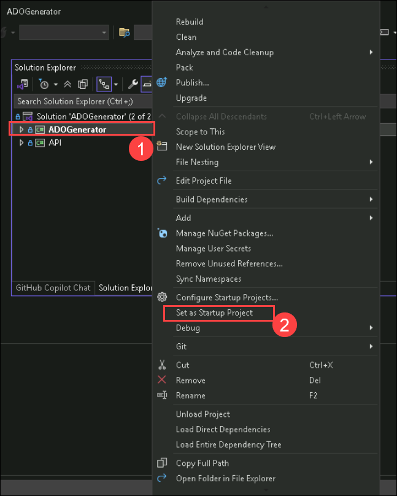
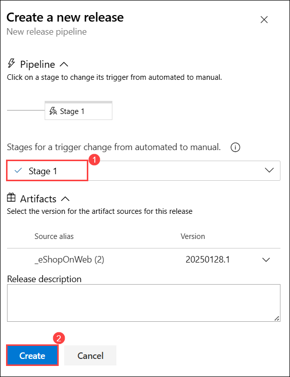

# Lab 5 : Defender for DevOps

## Overview:
In this lab, we'll explore integrating GitHub Advanced Security (GHAS) and Microsoft Defender for DevOps into your CI/CD pipeline to enhance security. We’ll focus on using GHAS and Defender for DevOps to automatically detect and address security issues within your pipeline. Instead of solely relying on traditional security measures, we’ll configure these tools to provide continuous security assessments and proactive responses directly within your DevOps environment.

## Estimated Duration: 180 Minutes

## Lab Objectives :

In this lab, you will complete the following tasks:

- Task 1: Understanding CI/CD pipelines in Azure DevOps
- Task 2: Identifying security issues in the pipeline
- Task 3: Overview of GitHub Advanced Security (GHAS) [Read-Only]
- Task 4: Overview of Defender for DevOps (including pricing) [Read-Only]
- Task 5: Securing your pipeline with GHAS
- Task 6: Connecting and Securing your Azure DevOps environment to MDC
- Task 7: Role of Defender Cloud Security Posture Management (DCSPM)

### Task 1: Understanding CI/CD pipelines in Azure DevOps

Continuous Integration and Continuous Deployment (CI/CD) are critical practices in modern software development, enabling teams to deliver code changes more frequently and reliably. Azure DevOps provides a robust platform to implement CI/CD pipelines. Here’s a basic understanding and a simple pipeline example to get you started.

#### CI/CD Pipelines in Azure DevOps

**Continuous Integration (CI):**
CI involves automatically building and testing your code every time a team member commits changes to version control. The key goals are to detect errors quickly and to improve software quality.

**Continuous Deployment (CD):**
CD extends CI by automatically deploying all code changes to a production environment after the build and test stages are successful. This ensures that the software is always in a releasable state.

#### 1. Components of a CI/CD Pipeline

1. **Source Control:** Where the code resides (e.g., Git repository).
2. **Build:** The process of compiling the source code into executable artifacts.
3. **Test:** Automated tests run to validate the code.
4. **Release:** Deploying the artifacts to staging or production environments.

#### 2. Set up an Azure DevOps organization.

1. On your lab VM open **Edge Browser** on desktop and navigate to [Azure DevOps](https://go.microsoft.com/fwlink/?LinkId=307137), and if prompted sign with the credentials.

   * Email/Username: <inject key="AzureAdUserEmail"></inject>

   * Password: <inject key="AzureAdUserPassword"></inject>

1. If prompted click **Ask later** on **Action Required** page.

3. On the next page accept defaults and click on continue.
   
   
   
1. On the **Almost Done...** page fill in the captcha and click on continue. 

   
    
1. On the Azure DevOps page click on **Azure DevOps** located at top left corner and then click on **Organization Setting** at the left down corner

   .png)
    
1. In the **Organization Setting** window on the left menu click on **Billing (1)** .

   

1. Select **Setup Billing (2)** then click on **save (3)**.

       

1. On the **MS Hosted CI/CD (1)** section under **Paid parallel jobs** enter value **1** and at the end of the page click on **Save (2)**.

   

1. On the **Organization Settings** page, go to the Security section and click **Policies (1)** . Enable the toggles for both **Third-party application access via OAuth (2)**  and **Allow public projects (3)**.

   

1. In the **Organization Settings** window, click on **Settings** in the left menu. On the settings page, toggles for **Creation of Classic Release Pipeline** option.

   

1. Navigate to **azuredevopsdemogenerator** using the link below. This utility site will automate the process of creating a new Azure DevOps project within your account that is prepopulated with content (work items, repos, etc.) required for the lab. For more information on the site, please see [https://docs.microsoft.com/en-us/azure/devops/demo-gen](https://docs.microsoft.com/en-us/azure/devops/demo-gen).

   ```
   https://azuredevopsdemogenerator.azurewebsites.net/
   ```
  
1. Navigate to **azuredevopsdemogenerator** using the link below. This utility site will automate the process of creating a new Azure DevOps project within your account that is prepopulated with content (work items, repos, etc.) required for the lab. For more information on the site, please see [https://docs.microsoft.com/en-us/azure/devops/demo-gen](https://docs.microsoft.com/en-us/azure/devops/demo-gen).

   ```
   https://azuredevopsdemogenerator.azurewebsites.net/
   ```

   

1. Since authentication is disabled, follow below steps to create the project

1. Navigate to Azure Devops Organization portal, then Click on **User settings (1)** and select **Personal access tokens (2)**.

   

1. Select **+ New Token**.

   

1. On **Create a new personal access token** window, enter the below values and click on **Create (3)**.

    | Setting | Value |
    |----------|-------|
    | Name | **Demogenerator (1)** |
    | Scopes | **full access (2)** |

    

1. Once you've generated the token, click on the **Copy** icon to the right of the secret value in the notepad. Once copied, click on **Close**.

   .png)

1. On the LabVM, Open the Start menu **(1)** and search for **Visual Studio 2022 (2)**. Select **Visual Studio 2022 (3)** to run it.

    

1. Select **Clone a repository** option from the Get started

    

1. Provide the below URL **(1)** for Repository location and select **Clone (2)**

   ```
   https://github.com/microsoft/AzDevOpsDemoGenerator/
   ```
    

   >**Note:** If prompt visual studio installer then click on **Install**.

   

1. Switch to **Solution Explorer**, right-click on **ADOGenerator (2)** project, and select **Set as Starer Project (3)**

    

1. Right-click on the **ADOGenerator (1)** solution file and select **Build solution (2)**.

    

1. Wait for the build to complete (1), then select **Start** from the top menu to run the project.

    

1. When prompted, enter the following details to create the **eShopOnWeb** project in your Azure DevOps organization.

   | Settings | Value |
   ---------|---------
   |Enter the template number from the list of templates above | Enter *1* to select the eShopOnWeb template |
   |Choose authentication method | Enter *2* for PAT authentication |
   |Enter your Azure DevOps organization name | Enter **odluser<inject key="DeploymentID" enableCopy="false"/>** |
   |Enter your Azure Devops Personal access token | Copy and paste the **PAT Token** from the notepad |
   |Enter the new project name | Enter **eShopOnWeb** |

    

1. You can go to your organization to confirm that the project was created once you see the Project created successfully message.
 
    

1. Click on **Repos** > **Branches**, then click the ellipsis next to your branch and select **Branch security**.

   

1. Select **Project Administrators** and set **Bypass policies when pushing** to **Allow** and click on **X** button.

   

### 3. Create a Simple HTML File

1. Click on **Repos (1)>Files (2)**, Click on the three-dot menu (`...`) in the top-right corner of the repository's file explorer section. This menu provides additional actions you can take within the repository.

1. After clicking the three-dot menu, a dropdown list appears. From this list, hover over the **New** option. This will allow you to create new items in the repository.

1. Under the **New** submenu, you have the option to create a "File" or a "Folder." In this case, you would click on **File** to start creating a new file within the repository.

   

1. A prompt will appear asking you to name your new file.

2. Enter a name for your HTML file, such as `index.html`.

   

1. Add the following content to `index.html` file:

    ```html
    <!DOCTYPE html>
    <html>
    <head>
        <title>My Simple HTML Page</title>
    </head>
    <body>
        <h1>Hello, Azure DevOps!</h1>
        <p>This is a simple HTML page used to demonstrate CI/CD pipelines.</p>
    </body>
    </html>
    ```

1. After writing your code, you can commit the changes by filling in the commit message and selecting whether to commit directly to the main branch or a different one.

1. Click **Commit** to save the file to your repository.

1. Navigate back to the **Pipelines** pane in of the **Pipelines** hub.

1. In the **Pipelines** window, click **New pipeline**.

   > **Note**: We will use the wizard to create a new YAML Pipeline definition based on our project.

1. On the **Where is your code?** pane, click **Azure Repos Git (YAML)** option.

   

1. On the **Select a repository** pane, click **eShopOnWeb**.

   

1. On the **Configure your pipeline** pane, scroll down and select **Starter pipeline**.

   

1. Define your build pipeline in a file named `azure-pipelines.yml` with the following content:

   ```yaml
   trigger:
   - main

   pool:
     vmImage: 'ubuntu-latest'

   steps:
   - task: UsePythonVersion@0
     inputs:
       versionSpec: '3.x'
     displayName: 'Set up Python'

   - script: |
      echo "Building the HTML project..."
      mkdir output
      cp index.html output/
     displayName: 'Build Project'

   - task: PublishBuildArtifacts@1
     inputs:
       pathToPublish: 'output'
       artifactName: 'html-artifact'
     displayName: 'Publish Artifacts'
   ```
1. This YAML file does the following:
   - **Trigger**: Runs the pipeline when changes are pushed to the `main` branch.
   - **Pool**: Uses an Ubuntu VM image for the build.
   - **Steps**:
   - Set up Python (although not used in this case, you might need it for other tasks).
   - Create a directory called `output` and copy `index.html` to it.
   - Publish the contents of `output` as build artifacts.
   
8. Click **Save and Run** then click **Save and Run** to start the Build Pipeline process.

   

9. Wait for the Build Pipeline to complete successfully.

   > **Note**: Each task from the YAML file is available for review, including any warnings and errors.

### 4. Create a Release Pipeline

1. Go to **Pipelines** > **Releases** > **New pipeline**.

   

1. From the **Select a template** window, **choose** **Azure App Service Deployment** (Deploy your application to Azure App Service. Choose from Web App on Windows, Linux, containers, Function Apps, or WebJobs) under the **Featured** list of templates.    

1. Click **Apply**.

   

1. Click on **Add an Artifact(1)** tab and select the **eShopOnWeb (2)**  in the Source (build pipeline) field. Click **Add (3)** to confirm the selection of the artifact.

   

1. On the All pipelines > New Release Pipeline pane, Click on **Tasks** tab and ensure that the **Stage 1** is selected. In the **Azure subscription(2)** dropdown list click on **Authentication**, Confirm the App Type is set to **Web App on Windows(3)**. Next, in the App Service name dropdown list, select the name of the **asclab-app (4)** web app.

   

   >**Note**: After Selecting your Azure subscription click Authorize. If prompted, authenticate by using the user account with the Owner role in the Azure subscription

1. Select the Task **Deploy Azure App Service**. In the **Package or Folder** field, Select Package or Folder. it shoud look like `"$(System.DefaultWorkingDirectory)/_eShopOnWeb (2)/html-artifact"`

   

1. On the **All pipelines > New Release Pipeline** pane, click **Save**.

   

1. In the **Save** dialog box, review your selections and click **OK** to confirm and finalize the saving process.


1. On the **All pipelines > New Release Pipeline** pane, click **Create release** then click on **Create**.

   
   
   

1. Wait until the release pipeline is completed.

   

1. Navigate to the Azure portal interface, navigate to the resource group **asclab**, and in the list of resources, click the **asclab-app-xxxxxxxxxxxxx** web app.

1. On the web app blade, click **Browse**.

   

1. Verify that the web page loads successfully in a new web browser tab.

   

> **Congratulations** on completing the task! Now, it's time to validate it. Here are the steps:
   - If you receive a success message, you can proceed to the next task.
   - If not, carefully read the error message and retry the step, following the instructions in the lab guide.
   - If you need any assistance, please contact us at cloudlabs-support@spektrasystems.com. We are available 24/7 to help you out.
 
<validation step="d1bea6eb-b9ab-4f67-8bbd-f90e80f58b8e" />

## Task 2: Identifying security issues in the pipeline

Integrate Microsoft Security DevOps into your Azure DevOps pipeline to scan Infrastructure as Code (IaC) templates for security issues. This process ensures early detection of vulnerabilities, enhances compliance and improves your overall security posture within existing DevOps workflows.

1. Click on **Repos (1)>Files**, Click on the three-dot menu (`...`) in the top-right corner of the repository's file explorer section. This menu provides additional actions you can take within the repository.

1. After clicking the three-dot menu, a dropdown list appears. From this list, hover over the **New** option. This will allow you to create new items in the repository.

1. Under the **New** submenu, you have the option to create a "File" or a "Folder." In this case, you would click on **Folder** to start creating a new Folder within the repository.

1. A prompt will appear asking you to name your Folder and File.

2. Enter a name for your Folder, such as `terraform` and file name such as `ask.tf`.

   

1. Add the following content to `ask.tf` file:

   ```
   resource azurerm_kubernetes_cluster "k8s_cluster" {
   dns_prefix          = "terragoat-${var.environment}"
   location            = var.location
   name                = "terragoat-aks-${var.environment}"
   resource_group_name = azurerm_resource_group.example.name
   identity {
     type = "SystemAssigned"
   }
   default_node_pool {
     name       = "default"
     vm_size    = "Standard_D2_v2"
     node_count = 2
   }
   addon_profile {
     oms_agent {
       enabled = false
    }
     kube_dashboard {
      enabled = true
     }
   }
   role_based_access_control {
     enabled = false
   }
   tags = {
     git_commit           =  "898d5beaec7ffdef6df0d7abecff407362e2a74e"
     git_file             = "terraform/azure/aks.tf"
     git_last_modified_at = "2020-06-17 12:59:55"
     git_last_modified_by = "nimrodkor@gmail.com"
     git_modifiers        = "nimrodkor"
     git_org              = "bridgecrewio"
     git_repo             = "terragoat"
     yor_trace            =  "6103d111-864e-42e5-899c-1864de281fd1"
    }
   }
   ```
1. After writing your code, you can commit the changes by filling in the commit message and selecting whether to commit directly to the main branch or a different one.

1. Click **Commit** to save the file to your repository.

1. Navigate back to **teraform** folder and Click on the three-dot menu (`...`) in the top-right corner of the repository's file explorer section.

1. Click on the three-dot menu to open a dropdown list. From the list, select the **Upload file(s)** option to upload files to the repository.

    

1. Click the **Browse** button in the Commit window to select files for upload.

   

1. Navigate to the `C:\Allfiles\terraform-file` folder, select all files, and click **Open**.

1. Click on **Commit** button in the Commit window to select files for upload.

   

1. Navigate to **Github** using the link below. 

   ```
   https://github.com/login
   ```
1. In the sign-in to GitHub page in edge browser, enter the **GitHub UserEmail** and **GitHub Password** and click on **Sign in**.

   

   >**Note**: Navigate to the **Environment** tab to view the key-value pairs of the **GitHub UserEmail**, and **GitHub Password** in the **license** section. You can use the copy buttons under the actions column to have the values copied instantly. Alternatively, it is suggested to have the values copied over onto a notepad for easy accessibility. 

     

1. Open a new tab and navigate to `https://www.microsoft.com/en-us/microsoft-365/outlook/log-in` then click on **Sign-in**.

   

1. You'll see the **Sign into Microsoft Outlokk** tab. Here, enter your email:
 
       
 
1. Next, provide your password:
 
   - **Password:** 
 
      

1. The email containing the verification code can sometimes creep into the archive/spam folders within your Outlook. Copy the verification code.

   

1. Navigate back to the **Device Verifition** page, enter the code you copied and click on **Verify**.

   

1. Under Dashboard, click **New** next to **Top repositories**.

   

1. On the **Create a new repository** page, set the repository name to **defender-for-cloud**.

   

1. Scroll down and select **Create repository**.

   

1. Copy the repository link to Notepad, as you'll need it to complete this task, and then click on **Creating a new file**.

   

1. Enter the name **defender-for-cloud.tf** and click on **Commit changes**.

   

1. Select **Commit changes**.

   

1. Click on your profile picture in the top right corner.

1. Select **Settings** from the dropdown menu.

   

1. Scroll down in the left sidebar and click on **Developer settings.**

   

1. In the Developer settings, click on **Personal access tokens.**

1. You may see two options: **Tokens (classic)** and **Fine-grained tokens** Click on **"Tokens (classic)"**.

   

1. Click on the **Generate new token** button and select **Generate new token (Classic)**.

   

1. **Configure Token Settings:**
   - **Token name**: Enter **mypattoken**
   - **Expiration**: Set an expiration for your token to 30 days.
   - **Select Scopes**: Choose the scopes (permissions) for your token:
     - select `repo`, `write:packages`, `admin:org`

1. Once you've configured everything, click on the **Generate token** button at the bottom of the page.

1. After generating, your new token will be displayed. **Copy it immediately** to the notepad as you won't be able to see it again. Store it in a secure place (e.g., password manager).

1. Return to Azure DevOps, click on **eShopOnWeb (1)**, and then select **Clone (2)**.

   

1. Copy the repository link to the notepad you will be needing to complete this task.

   

1. In your labvm, search and select powershell and run the following command to clone your Azure DevOps repository:

   ```bash
   git clone <azuredevopsrepo>
   ```

   >**Note**: Replace <azuredevopsrepo> with repository link you copied in the previous step.  

1. Enter **Email/Username**: <inject key="AzureAdUserEmail"></inject>, then click on **Next**.

    

1. Enter **Password**: <inject key="AzureAdUserPassword"></inject>, then click on **Sign in**.

   

1. Navigate to the directory:

   ```bash
   cd eShopOnWeb
   ```
2. **Navigate to the Terraform Folder:**
   Check the contents of the repository and navigate to the Terraform folder:

   ```bash
   cd terraform
   ```
3. **Copy the Files:**

   You can copy the files you want to share from the Terraform folder to a separate location on your machine. For example, create a new directory for the GitHub repo:

   ```bash
   mkdir ~/defender-for-cloud-files
   cp * ~/defender-for-cloud-files/   # Copies all files
   ```

   

4. Open a new PowerShell window and run the command to clone the GitHub repository:

   ```bash
   git clone <azuregithubrepo>
   ```
   >**Note**: Replace <azuregithubrepo> with repository link you copied in the previous steps.  

1. Navigate to the GitHub repo directory:

   ```bash
   cd defender-for-cloud
   ```
1. Copy the files from the Azure DevOps Terraform folder to the GitHub repo:

   ```bash
   cp ~/defender-for-cloud-files/* .   # Copies all files to the current directory
   ```
1. Set your global user email:

   ```bash
   git config --global user.email "you@example.com"
   ```
   >**Note**: Replace **you@example.com** with your GitHub email, for example, `github_cloudlabsuser_101@cloudlabsaiuser.com`.

1. Set your global user name:

   ```bash
   git config --global user.name "Your Name"
   ```
   >**Note**: Replace **Your Name** with your GitHub username, for example, `github-cloudlabsuser-101`.

1. Check the current configuration :

   ```bash
   git config --list
   ```
1. To add files to GitHub, use the following command:
 
   ```bash
   git add .
   ```
1. After setting your user information, you can commit changes with:

   ```bash
   git commit -m "Added new Terraform files"
   ```
1. Finally, push your changes to the remote repository (replace `origin` and `main` with your specific remote and branch names if needed):

   ```bash
   git push origin main
   ```

   **Note:** If prompted to connect to GitHub, select **token**, paste the token you copied earlier, and then click **Sign in**.

   

1. Go to the GitHub repository to access all the available files.

   

1. Go to the **Security** tab, select **Code scanning**, and then click on **Configure scanning tool**.

   

1. Click **Explore workflow** next to **Other tool**.

   

1. In the search box, type **tfsec**, select **tfsec**, and then click **Configure**.

   

1. Review the code, and then click **Commit changes**.

   

1. In the **Commit changes** pop-up, click **Commit changes**.

   

1. Go to the **Actions** tab, select the **Create tfsec.yml** pipeline, and wait for the pipeline to complete.

   

## Task 3: Overview of GitHub Advanced Security (GHAS) [Read-Only]

### Overview of GitHub Advanced Security (GHAS)

GitHub Advanced Security (GHAS) is a suite of security tools built into the GitHub platform designed to help developers secure their code and workflows. It includes features such as code scanning, secret scanning, and dependency review to identify and remediate security vulnerabilities and exposures.

1. Enable GitHub Advanced Security
To use GHAS, you need to have GitHub Advanced Security enabled for your repository. This typically requires a GitHub Enterprise subscription.

   - Navigate to your repository on GitHub.
   - Click on `Settings`.
   - In the `Security` section, find `GitHub Advanced Security` and enable it.

2. Configure Code Scanning

   **Code scanning** helps detect vulnerabilities and errors in your code by running static analysis tools.

   - Go to the `Security` tab of your repository.
   - Click on `Set up code scanning`.
   - You can choose from different options like `CodeQL Analysis`, which is a powerful tool provided by GitHub. Select the `Set up this workflow` button for `CodeQL Analysis`.
   - Review the configuration file (e.g., `.github/workflows/codeql-analysis.yml`). Modify it if needed and commit it to your repository.

3. Run Code Scanning

   - Once configured, code scanning runs automatically on the specified events (like pushes and pull requests).
   - You can also manually trigger a scan by going to the `Actions` tab, finding the `CodeQL` workflow, and clicking `Run workflow`.

4. Review Code Scanning Results

   - Navigate to the `Security` tab, and under `Code scanning alerts`, you'll see a list of detected issues.
   - Click on any alert to get detailed information about the vulnerability and recommended fixes.

5. Configure Secret Scanning

   **Secret scanning** detects secrets (like API keys and tokens) that may have been accidentally committed to your repository.

   - Go to the `Security` tab of your repository.
   - Click on `Set up secret scanning`.
   - GitHub automatically scans for patterns that match common secret types and alerts you if any are found.

6. Review Secret Scanning Results

   - Navigate to the `Security` tab, and under `Secret scanning alerts`, you'll see a list of detected secrets.
   - Click on any alert to view details and follow the steps to revoke or rotate the compromised secrets.

7. Set Up Dependency Review

   **Dependency review** helps you understand and remediate vulnerable dependencies in your project.

   - Ensure your project has a dependency manifest file (e.g., `package.json`, `pom.xml`).
   - GitHub automatically generates dependency graphs and checks for known vulnerabilities in your dependencies.

8. Review Dependency Alerts

   - Navigate to the `Security` tab, and under `Dependency review`, you'll see alerts for vulnerable dependencies.
   - Click on any alert to see details about the vulnerability and recommended versions to update to.

9. Manage Security Policies
  
   - In the `Security` tab, you can also manage security policies by setting up a `security.md` file to inform users about your project's security practices and how they can report vulnerabilities.

10. Continuous Monitoring and Alerts

      - GitHub Advanced Security continuously monitors your repository and generates alerts for any new issues found.
      - Make it a habit to regularly review the `Security` tab and address any new alerts promptly.

## Task 4: Overview of Defender for DevOps (including pricing) [Read-Only]

Defender for DevOps is a security solution by Microsoft designed to enhance the security of DevOps environments. It provides a range of tools and features to help secure the software development lifecycle (SDLC) and protect against threats that target DevOps processes. Here's an overview:

### Overview of Microsoft Defender for DevOps

**Microsoft Defender for DevOps** helps secure your DevOps environments and pipelines by integrating with popular DevOps tools and providing security recommendations for your code and infrastructure. It focuses on the following areas:

1. **Source Code Security**: Scans your code repositories to identify vulnerabilities and security issues in your source code.
2. **Pipeline Security**: Monitors and protects your CI/CD pipelines from potential threats and unauthorized access.
3. **Infrastructure as Code (IaC) Security**: Analyzes your IaC templates (e.g., Terraform) for potential security risks and misconfigurations.

**Key Features:**
- **Integration**: Works with tools like GitHub, Azure DevOps, and Bitbucket.
- **Vulnerability Scanning**: Identifies vulnerabilities in your code, dependencies, and configuration files.
- **Security Recommendations**: Provides actionable insights and recommendations for securing your pipelines and code.
- **Compliance**: Helps ensure compliance with industry standards and best practices.

### Pricing

The pricing for Microsoft Defender for DevOps is generally included as part of the broader Microsoft Defender for Cloud offering, specifically under **Defender for Cloud's Cloud Security Posture Management (CSPM)** plan. Here’s a general breakdown:

- **Microsoft Defender for Cloud (Free Tier)**: Basic security features, including Azure Security Center and Azure Defender for servers.
- **Microsoft Defender for Cloud (Standard Tier)**: Includes advanced features such as Defender for DevOps, Defender for Cloud's comprehensive protection, and threat detection capabilities. 

For exact pricing details, especially as they can vary based on the size of the environment and specific needs, it's best to consult the [Microsoft Defender for Cloud pricing page](https://azure.microsoft.com/en-us/pricing/details/defender-for-cloud/) or contact Microsoft sales for a customized quote.

### Inclusion in Defender for CSPM

**DevOps Security Posture** is included as part of the **Defender for CSPM** plan, which provides a unified view of your security posture across various cloud environments, including DevOps. This integration means that DevOps security capabilities are seamlessly integrated into the overall cloud security management, offering a more comprehensive approach to securing both your cloud infrastructure and development workflows.

## Task 5: Securing your pipeline with GHAS

To secure your pipeline with GitHub Advanced Security (GHAS) and Microsoft Defender for DevOps, you can integrate these tools to enhance your pipeline's security posture. Here’s an example of how to use GHAS and Defender for DevOps for security:

#### Enable Advanced Security from Portal

GitHub Advanced Security for Azure DevOps includes extra permissions for more levels of control around Advanced Security results and management. Be sure to adjust individual permissions for your repository.

To ensure Azure DevOps Advanced Security is enabled in your organization, you can follow these steps:

1. Click **Project settings (1)** in the lower-left corner. In the left menu under Repos, click **Repositories (2)**, then select the **eShopOnWeb (3)** repository.

   .png)

1. Click on **Settings (1)**, then click on **Advanced Security (2)**, to turn it **On** and click **Enable all**.

    .png)

1. Click **Begin Billing**.

    

1. Advanced Security and Push Protection are now enabled. You can also onboard Advanced Security at [Project-level](https://learn.microsoft.com/en-us/azure/devops/repos/security/configure-github-advanced-security-features?view=azure-devops&tabs=yaml#project-level-onboarding) and [Organization-level](https://learn.microsoft.com/en-us/azure/devops/repos/security/configure-github-advanced-security-features?view=azure-devops&tabs=yaml#organization-level-onboarding) as well but we recommend for this hands-on lab to enable it only for repository level.

#### Create a pull request

1. Navigate to the **Pipelines** pane in the **Pipelines** hub.

1. Click **New pipeline** in the **Pipeline** window.

1. Select **Azure Repos Git (YAML)** on the **Where is your code?** pane.

   

1. Click **eShopOnWeb** on the **Select a repository** pane.

   

1. Scroll down and select **Starter pipeline** on the **Configure your pipeline** pane.

   

1. Define your build pipeline in a file named `azure-pipelines.yml` with the following content:

   ```
   trigger:
    - main
    
   pool:
      vmImage: ubuntu latest
    
   extends: 
      template: template.yaml
      parameters:
        stages:
          - stage: Build
            displayName: 'Build'
            jobs:
            - job: Build
              steps:
              - checkout: self
    
              - task: DotNetCoreCLI@2
                displayName: Restore 
                inputs:
                  command: restore
                  projects: '**/*.csproj'
    
              - task: ms.advancedsecurity-tasks.codeql.init.AdvancedSecurity-Codeql-Init@1
                condition: and(succeeded(), ne(variables['Build.Reason'], 'PullRequest'))
                displayName: 'Initialize CodeQL'
                inputs:
                  languages: csharp
                  querysuite: default
    
              - task: DotNetCoreCLI@2
                displayName: Build
                inputs:
                  projects: '**/*.csproj'
                  arguments: '--configuration $(BuildConfiguration)'
    
              - task: ms.advancedsecurity-tasks.dependency-scanning.AdvancedSecurity-Dependency-Scanning@1
                condition: and(succeeded(), ne(variables['Build.Reason'], 'PullRequest'))
                displayName: 'Dependency Scanning'
    
              - task: ms.advancedsecurity-tasks.codeql.analyze.AdvancedSecurity-Codeql-Analyze@1
                condition: and(succeeded(), ne(variables['Build.Reason'], 'PullRequest'))
                displayName: 'Perform CodeQL analysis'
    
              - task: ms.advancedsecurity-tasks.codeql.enhance.AdvancedSecurity-Publish@1
                condition: and(succeeded(), ne(variables['Build.Reason'], 'PullRequest'))
                displayName: 'Publish Results'
    
              - task: DotNetCoreCLI@2
                displayName: Test
                inputs:
                  command: test
                  projects: '[Tt]ests/**/*.csproj'
                  arguments: '--configuration $(BuildConfiguration) --collect:"Code coverage"'
    
              - task: DotNetCoreCLI@2
                displayName: Publish
                inputs:
                  command: publish
                  publishWebProjects: True
                  arguments: '--configuration $(BuildConfiguration) --output $(build.artifactstagingdirectory)'
                  zipAfterPublish: True
    
              - task: PublishBuildArtifacts@1
                displayName: 'Publish Artifact'
                inputs:
                  PathtoPublish: '$(build.artifactstagingdirectory)'
                condition: succeededOrFailed()
    ```
     
1. Click on **Save and Run** and then **Save and Run** .

1. Please navigate to the pipeline and select it. The execution may take around 5 minutes to complete. Kindly wait until the build finishes, then review the pipeline result.

   

## Task 6: Connecting and Securing your Azure DevOps environment to MDC

1. Navigate to the Azure portal.

1. Search and select **Microsoft Defender for Cloud** from the portal

   

1. Select **skip** on **Getting started** tab.

   

1. Select **Environment settings** under Management > **+Add environment** > **Azure DevOps**

   .png)

1. On the **Azure DevOps Connection** page, under **Account details**, provide the below settings.

   | Setting  | Value |
   -----------|---------
   | Connector name | AzureDevopsconnector |
   | Subscription | Choose the default subscription |
   | Resource group | defenderforcloud |
   | Location | East US|

   

1. Select **Next: Select plans**

1. In **Select plans**, leave as defult and click on **Next: Configure access**

1. Select **Authorize**. Ensure you're authorizing the correct Azure Tenant using the drop-down menu in Azure DevOps and by verifying you're in the correct Azure Tenant in Defender for Cloud.

1. In the popup dialog, read the list of permission requests, and then select **Accept**.

   

1. Leave all other settings as default.

1. Select **Next: Review and generate**.

1. Review the information, and then select **Create**.

1. Wait for some time to view the connector on the **Environment settings** page.

1. Navigate to **DevOps Security** under **Cloud Security**.

   

1. The **DevOps security findings** and **DevOps security results** are listed on the page, which helps to review the DevOps security posture.

   

   >**Note:** It might take upto 24hrs to reflect the real-time status.

1. Navigate to **DevOps workbook** and change the toggle to **Yes**, which provides an overview of the tabs provided below

   

   

1. Navigate to the **Infrastructure as Code** tab and scroll down, click on the **Severity** section to open the individual findings, and click on **Information** which in turn provides detailed findings and the issue location.

   

1. Similarly, navigate to the **Secrete** tab and click on **link** and identify the issues.

   

1. Then take note of the recommendations provided to resolve the issues.

   

1. Navigate back to **Environment settings** under Management > **+Add environment** > **Github**.

   

1. On the **Github Connection** page, under **Account details**, provide the below settings.

   | Setting  | Value |
   -----------|---------
   | Connector name | Githubconnector **(1)** |
   | Subscription | Choose the default subscription **(2)**  |
   | Resource group | defenderforcloud **(3)**  |
   | Location | East US **(4)** |

   

1. Select **Next: Configure access (5)**

1. Select **Authorize (1)**. Ensure you're authorizing the correct Azure Tenant using the drop-down menu in Azure DevOps and by verifying you're in the correct Azure Tenant in Defender for Cloud.

1. In the popup dialog, read the list of permission requests, and then select **Accept**.

1. Select **Install (2)**.

   

   **Note:** To install Microsoft Security DevOps, follow the prompt to select the GitHub username where you would like the installation to take place.

   

1. On the **Install on your personal account github-cloudlabsuser-xxx** pop-up, choose **Only select repositories**, then from the list, select **defender-for-cloud** and click **Install**.

1. Select **Next: Review and generate (3)**.

1. Review the information, and then select **Create**.

1. You will be prompted to log in to your GitHub account. Authenticate and authorize Microsoft Azure to access your GitHub organization.

1. Once connected, select the GitHub repositories that you want to integrate with Defender for Cloud.

1. Review and confirm the repository connections.

1. After the connection is established, Defender for Cloud will begin monitoring the selected repositories for vulnerabilities and other security issues.

1. In the Microsoft Defender for Cloud portal, go to **Recommendations** under the **Secure Score** tab.
   
1. You may see recommendations such as: ` GitHub repositories should have code scanning findings resolved.`

   >**Note:** It may take up to 8 hours to receive recommendations in Defender for Cloud.

1. Recommendation will contain detailed remediation steps provided by Defender for Cloud. You can click on each issue to get more information about its severity and how to fix it.

    

1. In your GitHub repository, go to the **Security** tab.

1. You’ll see a list of issues identified by GitHub Advanced Security such as code scanning results.

    

1. Follow the instructions provided in both GitHub and Defender for Cloud to resolve each issue. You may need to:
     - Fix vulnerable code.
     - Rotate or remove exposed secrets.
     - Update vulnerable dependencies to safe versions.

1. As issues are resolved, both GitHub and Defender for Cloud will update the status of the recommendations.

1. To verify everything is set up correctly, push a commit that introduces a known vulnerability (e.g., a hardcoded secret or vulnerable dependency).
   
1. After pushing the commit, check GitHub for security alerts and verify that the same issues appear as recommendations in Defender for Cloud under the **DevOps Security** section.

1. Defender for Cloud will continuously monitor your connected GitHub repositories and provide real-time security recommendations. You can monitor these from the **Secure Score** and **Recommendations** sections.

## Task 7: Role of Defender Cloud Security Posture Management (DCSPM)

DevOps Security Posture, as part of Cloud Security Posture Management (CSPM), involves assessing and enhancing the security of your development and deployment processes within the cloud. Here's a detailed discussion on what CX (Customer Experience) gets in terms of DevOps security posture within CSPM:

### 1. Overview of CSPM and DevOps Security

CSPM focuses on ensuring that your cloud environment adheres to security best practices and compliance requirements. It helps in identifying misconfigurations, vulnerabilities, and compliance issues within your cloud resources. When integrated with DevOps processes, CSPM aims to secure the entire development lifecycle from code to deployment.

### 2. Key Aspects of DevOps Security Posture in CSPM

- **Infrastructure as Code (IaC) Scanning**: CSPM solutions often include the ability to scan IaC templates for security vulnerabilities and misconfigurations before they are deployed. This ensures that any security issues are identified early in the development process, reducing the risk of deploying insecure configurations.

- **Continuous Integration/Continuous Deployment (CI/CD) Pipelines Security**: CSPM tools can monitor and secure CI/CD pipelines to ensure that the processes involved in building, testing, and deploying applications are secure. This includes checking for vulnerabilities in the build environment, ensuring secure access controls, and monitoring the integrity of the deployment process.

- **Compliance Monitoring**: CSPM solutions can help ensure that your DevOps processes comply with industry standards and regulations. This includes monitoring for adherence to policies like GDPR, HIPAA, or PCI-DSS within your development and deployment practices.

- **Threat Detection and Response**: Advanced CSPM tools provide real-time threat detection and response capabilities. They can identify suspicious activities or potential security incidents in your DevOps processes and provide recommendations for remediation.

- **Configuration Management**: Ensuring that configurations used in development, staging, and production environments are securely managed and adhere to best practices is a critical aspect of DevOps security posture. CSPM tools help in monitoring and enforcing secure configurations across all environments.

### 3. Demonstrating DevOps Security Posture

To showcase the DevOps security posture provided by CSPM, you can create a lab or demonstration that highlights the following:

- **IaC Scanning**: Show how CSPM tools can scan Terraform or other IaC templates for security issues. Demonstrate how vulnerabilities are identified and how they can be fixed before deployment.

- **Pipeline Security**: Set up a demo of a CI/CD pipeline integrated with CSPM tools. Highlight how the tool monitors the pipeline for security issues, such as insecure dependencies or misconfigured pipeline settings.

- **Compliance Checks**: Display how the CSPM solution continuously monitors for compliance with various standards and regulations, providing actionable insights and recommendations.

- **Incident Response**: Simulate a security incident within the DevOps process and demonstrate how the CSPM tool detects and responds to the threat, including the remediation steps.

1. Integrating CSPM with DevOps processes provides a comprehensive approach to securing your development lifecycle, from coding to deployment. By leveraging CSPM tools, you ensure that security is baked into the DevOps process, reducing vulnerabilities and ensuring compliance.

1. Navigate back to the **Recommendations** page of defender for cloud, filter the recommendations by selecting only **Azure DevOps connections**, and then choose the **Azure DevOps repositories should have secrets scanning findings resolved** recommendation.

   

1. Review the **Take actions** tab, where you'll find steps to remediate the issue.

   

1. Navigate to the **Findings** tab, where you'll find detailed information related to the identified issues.

   

1. Navigate back to the **Recommendations** page, filter the recommendations by selecting only **Azure DevOps connections**, and then choose the **Azure DevOps repositories should have infrastructure as code scanning findings resolved** recommendation.

   

1. Review the **Take actions** tab, where you'll find steps to remediate the issue.

   

1. Navigate to the **Findings** tab to review detailed information about the identified issues. To resolve the errors in the `sql.tf` file, review the file in Azure DevOps and address the issue at line 31. Similarly, you can check the other IDs listed and fix the corresponding errors.

   

1. Navigate back to the **Recommendations** page, filter the recommendations by selecting only **Azure DevOps connections**, and then choose the **Azure DevOps repositories should have dependency vulnerability scanning findings resolved** recommendation.

   

1. Review the **Take actions** tab, where you'll find steps to remediate the issue.

   

1. Navigate to the **Findings** tab, where you'll find detailed information related to the identified issues.

   

1. Navigate back to the **Recommendations** page, filter the recommendations by selecting only **Azure DevOps connections**, and then choose the **Azure DevOps repositories should require minimum two-reviewer approval for code pushes** recommendation.

   

1. Review the **Take actions** tab, where you'll find steps to remediate the issue.

   

1. Click on the **View recommendations for all resources** from the top.

   

1. Expand the affected resources and review the unhealthy resources.

   

   >**Note**: It may take up to 24 hours to receive all the recommendations.

### Remove the Azure DevOps billing

1. On the lab computer, switch to the browser window displaying Azure DevOps organization homepage and select **Organization Settings** at bottom left corner.

2. Under **Organization Settings** select **Billing (1)** and click on **Change billing (2)** button to open Change billing pane.

3. In the **Change billing** pane, select **Remove billing (3)** setting and click on **Save (4)**.

   

### Deleting Github repository

1. Navigate to the Defender-for-cloud repository main page on GitHub.

1. Click on the **Settings** tab.

   

1. Scroll down to the **Danger Zone** section.

1. Click on **Delete this repository**.

   

1. If the pop-up confirms the permanent deletion of the repository and its contents, click on **I acknowledge that I have read and understand the implications of this action.**

   

1. In the confirmation pop-up, type the repository name to confirm, and then click **Delete this repository**.

   

1. This will permanently delete the repository.

## Summary:

In this module, you explored various aspects of securing CI/CD pipelines in Azure DevOps. You began by understanding the role of CI/CD pipelines and identifying potential security vulnerabilities within them. Using Defender for DevOps, you pinpointed and assessed security issues, learning how they could impact your pipeline. You also reviewed GitHub Advanced Security (GHAS) and Defender for DevOps, gaining insight into their features and pricing. Integration tasks included securing your pipeline with GHAS and Defender for DevOps, and connecting Azure DevOps to Microsoft Defender for Cloud (MDC) Finally, you examined the role of Defender Cloud Security Posture Management (DCSPM) in enhancing your cloud security posture. This module provided a comprehensive approach to securing DevOps environments and pipelines, integrating various security tools to improve overall security and management.

## You have successfully completed the lab >> Click on Next
